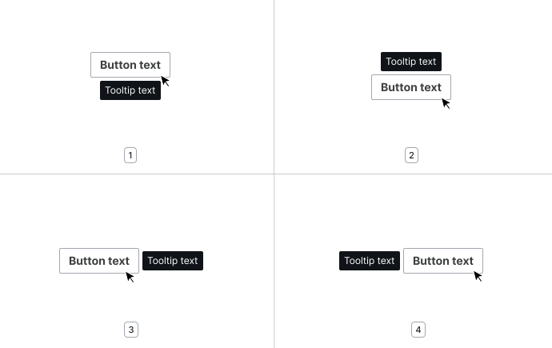
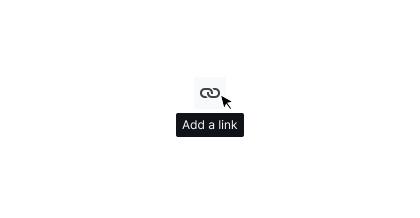
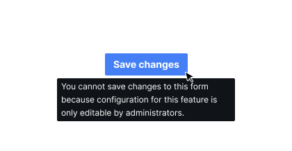
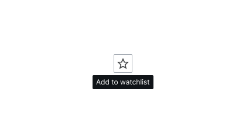
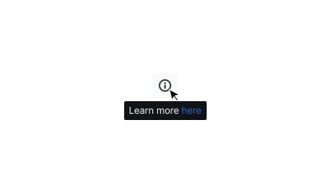
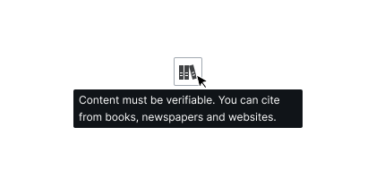
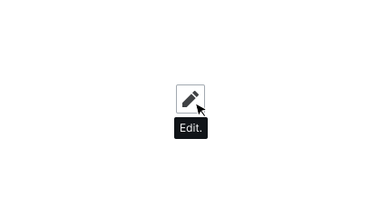

<script setup>
import TooltipConfigurable from '@/../component-demos/tooltip/examples/TooltipConfigurable.vue';
import TooltipBasic from '@/../component-demos/tooltip/examples/TooltipBasic.vue';
import TooltipPlacement from '@/../component-demos/tooltip/examples/TooltipPlacement.vue';

const controlsConfig = [
	{
		name: 'placement',
		type: 'select',
		menuItems: [
			{ value: 'bottom' },
			{ value: 'bottom-start' },
			{ value: 'bottom-end' },
			{ value: 'top' },
			{ value: 'top-start' },
			{ value: 'top-end' },
			{ value: 'right' },
			{ value: 'right-start' },
			{ value: 'right-end' },
			{ value: 'left' },
			{ value: 'left-start' },
			{ value: 'left-end' }
		]
	},
	{
		name: 'textContent',
		type: 'text',
		initial: 'Tooltip text'
	}
];

</script>

# Tooltip

A tooltip is a brief message that shows up when a user hovers over a specific part of the user interface, providing additional information.

## Guidelines

### When to use tooltips

Use the Tooltip component to add a small piece of information to its associated element. Tooltips can be used to explain the meaning or purpose of interface elements like icons and buttons where the initial element might not be clear, or to show the full version of truncated text where space is not available.

### Specifications

The Tooltip component includes text-only content.


### Component limitations

The minimum width for the Tooltip component is set at `@size-125` (equivalent to 24px in the default Codex theme). The maximum width is set at `@size-600` (equivalent to 256px).

Refer to the [Tooltip component in Codex Figma](https://www.figma.com/design/KoDuJMadWBXtsOtzGS4134/%E2%9D%96-Codex-components?m=auto&node-id=17954-2437&t=RVlYIfoOsmLFBzgY-1).

### Types

By default, the Tooltip appears beneath its trigger, but automatically moves based on the placement of the trigger and the edge of the viewport. The default placement can be set to one of four options:
1. Bottom
2. Top
3. Right
4. Left



### Interaction states

The Tooltip component is purely informational, and is not inherently interactive. The Tooltip will be shown on hover or focus of its trigger. On touchable screens, the tooltip can be shown by long pressing on the trigger.

### Best practices

Consider the following recommendations when working with tooltips.

#### Usage

<cdx-demo-rules>
<template #do-media>



</template>
<template #do-text>

- Use a tooltip to provide further clarification or give additional context and information.

</template>
<template #dont-media>



</template>
<template #dont-text>

- Provide significant details or information, such as errors — tooltips can be easily overlooked.

</template>
</cdx-demo-rules>

#### Contents

<cdx-demo-rules>
<template #do-media>



</template>
<template #do-text>

- Use only text within a tooltip.

</template>
<template #dont-media>



</template>
<template #dont-text>

- Include interactive elements like links or buttons within a tooltip.

</template>
</cdx-demo-rules>

### Content

Tooltips are used to describe visual elements or elaborate on textual elements in as few words as possible. Content for Tooltips should be short and concise.

<cdx-demo-rules>
<template #do-media>



</template>
<template #do-text>

- Use punctuation for more than one sentence, or when the truncated text includes punctuation.

</template>
<template #dont-media>



</template>
<template #dont-text>

- Use punctuation when the text consists of just one sentence.

</template>
</cdx-demo-rules>

### Keyboard navigation

| Key | Function |
| -- | -- |
| <kbd>Esc</kbd> | Dismisses the tooltip. |

## Demos

### Configurable

<cdx-demo-wrapper :controls-config="controlsConfig">
<template v-slot:demo="{ propValues }">
	<tooltip-configurable v-bind="propValues" />
</template>
</cdx-demo-wrapper>


### Basic Example

Apply the custom tooltip directive, `v-tooltip` to a component or native HTML element.
When you hover over the component or element, the tooltip displays additional information.

<cdx-demo-wrapper>
<template v-slot:demo>
	<tooltip-basic />
</template>

<template v-slot:code>

:::code-group

<<< @/../component-demos/tooltip/examples/TooltipBasic.vue [NPM]

<<< @/../component-demos/tooltip/examples-mw/TooltipBasic.vue [MediaWiki]

:::

</template>

</cdx-demo-wrapper>

### Custom placement

The default placement of the tooltip is `bottom`. Specify the placement by using an argument in your
directive like `v-tooltip:top`. The `top` argument places the tooltip on top of the reference
element.

The tooltip can appear in the following places:
- `bottom`, `bottom-start`, `bottom-end`
- `top`, `top-start`, `top-end`
- `right`, `right-start`, `right-end`
- `left`, `left-start`, `left-end`

<cdx-demo-wrapper>
<template v-slot:demo>
	<tooltip-placement />
</template>

<template v-slot:code>

:::code-group

<<< @/../component-demos/tooltip/examples/TooltipPlacement.vue [NPM]

<<< @/../component-demos/tooltip/examples-mw/TooltipPlacement.vue [MediaWiki]

:::

</template>

</cdx-demo-wrapper>

## Vue Usage

The Tooltip component is implemented as a Vue.js
[custom directive](https://vuejs.org/guide/reusability/custom-directives.html#custom-directives).
This means that rather than existing as a stand-alone component, it can be added
to any component or markup element inside of a Vue.js template.

To use the Tooltip, register it under the `directives` property instead of the `components`
property:

```js{7-9}
import { defineComponent } from 'vue';
import { CdxButton, CdxTooltip } from '@wikimedia/codex';

export default defineComponent( {
	name: 'MyComponent',
	components: { CdxButton },
	directives: {
		tooltip: CdxTooltip
	}
} );
```

In the example above, a directive registered under the name `tooltip` can be used
in templates as `v-tooltip`.

If the Tooltip directive is needed across multiple components, consider registering
it globally when the Vue app is mounted:

```js{6}
import { createApp } from 'vue';
import MyApp from './App.vue';
import { CdxTooltip } from '@wikimedia/codex';

const app = createApp( App )
    .directive( 'tooltip', CdxTooltip )
	.mount( '#my-app' );
```

::: warning Not directly usable on all components
Vue directives work best when they are applied directly on HTML elements inside
another component's template, like `<button>` or `<input>`.

A directive can also be used on another Vue component, but it will always be applied
to the outermost element of that component's own template. The tooltip directive will
function as expected when used with the `CdxButton` component (because the outermost
element of that component is a `<button>` element), but it will *not* behave correctly
when used with the `CdxTextInput` component (which has a `<div>` as the outermost element).

Future Codex releases may update components like `CdxTextInput` so that the
tooltip functionality is built-in. See the Vue docs about custom directives for more
information about how to work with custom directives.
:::