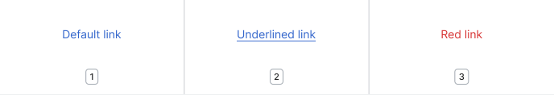
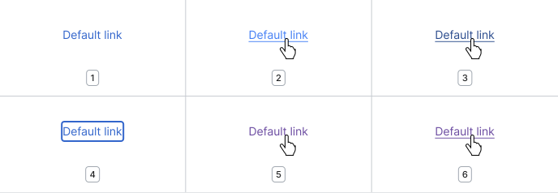
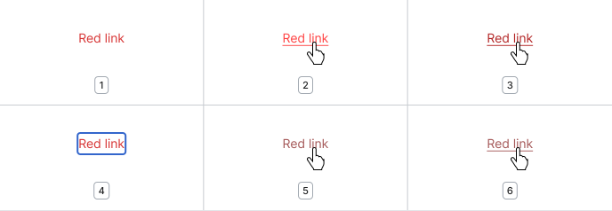

<script setup>
// Note that this file is temporarily located here so we can quickly get a page up documenting the
// link mixin. It will be moved to a more permanent location once we determine a final documentation
// structure for component mixins.
import { CdxIcon } from '@wikimedia/codex';
import { cdxIconLinkExternal } from '@wikimedia/codex-icons';
</script>

# Link
A Link navigates the user to another page, view or section, when the user clicks or taps on it.

## Guidelines

### Using links
Links must include descriptive text, or a combination of text and an icon.

Use the Link component when you need to provide users with a clickable element to navigate to other
pages. Avoid using Link when the user needs to perform an action. In such cases, use
[Button](../demos/button.md) instead.


### Specifications


1. **Link text**<br>The text that describes the link destination as clearly as possible.
2. **External link icon**<br>Indicates that the link will take the user to a different website.

Apart from links that navigate to other pages, there are the following different links:

- Links that open a modal instead of a new page (e.g. map links)
- Links that open a file instead of a web page (e.g. PDF or document links)
- Links that cause something to happen that the user would otherwise not expect (e.g. play a sound, like pronunciation links)
- Links that open a new website instead of just a new page (external links)<sup>[[1]](#ref1)</sup>
- Links that open a non-web protocol URI (e.g. `mailto:`, `tel:` links)

Several Wikimedia Movement projects provide extensive “manuals of style” for applying and designing for links, for example English Wikipedia.<sup>[[2]](#ref2)</sup>

Refer to the [Link component in Codex Figma](https://www.figma.com/file/KoDuJMadWBXtsOtzGS4134/%E2%9D%96-Codex-components?type=design&node-id=7250-67780&mode=design&t=eVqRGnL1b9RbOdZ0-11).

### Types



1. **Base links**<br>By default, links are only underlined when they are interacted with (hover,
active).
2. **Underlined links**<br>To suit user preferences and for accessibility reasons, links can always
be underlined.
3. **Red links (aka new links)**<br>Links to pages that do not exist yet. These display the
color Red600 for both the normal or underlined types.<sup>[[3]](#ref3)</sup>

### Interaction states
Links display accessible color variations that help clearly differentiate their interaction states:

#### Base link



#### Red link



1. Default
2. Hover
3. Active
4. Focus
5. Visited
6. Visited and hover

Links display the default browser outline on focus, which is equal to Blue600. The outline style varies in different browsers.<br>
Links don't feature a disabled state. If you’re trying to convey an action, you might consider using a [quiet button](../demos/button.md#quiet-buttons-frameless) for that scenario instead.

### Content

The tone of a link should let a user know exactly where they will go when they select it. Link copy should be short and descriptive.

#### Base link

Base links signal to users the option to navigate to a different page, view, or resource.

<cdx-demo-rules>
<template #do-media>


</template>
<template #do-text>

- Highlight only the phrase that indicates the link destination. [*Translatable*](../../style-guide/writing-for-copy.html#is-this-translatable)

</template>
<template #dont-media>


</template>
<template #dont-text>

- Use the words click, tap or here. Avoiding these terms makes things clear and precise, whether the reader is using an assistive device, a mobile device or a desktop experience. [*Accessible*](../../style-guide/writing-for-copy.html#is-this-accessible)

</template>
</cdx-demo-rules>

#### Red link

Red links are used to indicate that a page does not exist. Typically a red link is added to indicate that a page will be, or should be created soon.

<cdx-demo-rules>
<template #do-media>


</template>
<template #do-text>

- Create a title using appropriate [naming conventions](https://en.wikipedia.org/wiki/Wikipedia:Article_titles?useskin=vector-2022#Article_title_format). [*Clear*](../../style-guide/writing-for-copy.html#is-this-clear)

</template>
<template #dont-media>


</template>
<template #dont-text>

- Use special characters in the title. [*Clear*](../../style-guide/writing-for-copy.html#is-this-clear)

</template>
</cdx-demo-rules>

### References
1. <span id="ref1">[English Wikipedia: External links](https://en.wikipedia.org/wiki/Wikipedia:External_links)</span>
2. <span id="ref2">[English Wikipedia: Manual of Style/Linking](https://en.wikipedia.org/wiki/Wikipedia:Manual_of_Style/Linking)</span>
3. <span id="ref3">[English Wikipedia: Red link](https://en.wikipedia.org/wiki/Wikipedia:Red_link#When_to_create_red_links)</span>

## Demos

Click on a link to see visited link styles.

### Base link

<cdx-demo-wrapper :allow-link-styles="true">
<template v-slot:demo>
	<p>The cat (Felis catus) is a <a class="cdx-docs-link" href="https://en.wikipedia.org/wiki/Species">domestic species</a> of small <a class="cdx-docs-link" href="https://en.wikipedia.org/wiki/Carnivore">carnivorous mammal</a>.</p>
</template>

<template v-slot:code>

:::code-group

```vue [NPM]
<template>
	<p>
		The cat (Felis catus) is a <a class="cdx-docs-link" href="https://en.wikipedia.org/wiki/Species">domestic species</a>
		of small <a class="cdx-docs-link" href="https://en.wikipedia.org/wiki/Carnivore">carnivorous mammal</a>.
	</p>
</template>

<style lang="less">
// Note: you must import the design tokens before importing the link mixin
@import ( reference ) '@wikimedia/codex-design-tokens/theme-wikimedia-ui.less';
@import ( reference ) '@wikimedia/codex/mixins/link.less';

.cdx-docs-link {
	.cdx-mixin-link();
}
</style>
```

```vue [MediaWiki]
<template>
	<p>
		The cat (Felis catus) is a <a class="cdx-docs-link" href="https://en.wikipedia.org/wiki/Species">domestic species</a>
		of small <a class="cdx-docs-link" href="https://en.wikipedia.org/wiki/Carnivore">carnivorous mammal</a>.
	</p>
</template>

<style lang="less">
@import 'mediawiki.skin.variables.less';

.cdx-docs-link {
	.cdx-mixin-link();
}
</style>
```

:::

</template>
</cdx-demo-wrapper>

### Underlined link

<cdx-demo-wrapper :allow-link-styles="true">
<template v-slot:demo>
	<p>As a <a class="cdx-docs-link is-underlined" href="https://en.wikipedia.org/wiki/Predation">predator</a>, it is <a class="cdx-docs-link is-underlined" href="https://en.wikipedia.org/wiki/Crepuscular_animal">crepuscular</a>, i.e. most active at dawn and dusk.</p>
</template>

<template v-slot:code>

:::code-group

```vue [NPM]
<template>
	<p>
		As a <a class="cdx-docs-link is-underlined" href="https://en.wikipedia.org/wiki/Predation">predator</a>,
		it is <a class="cdx-docs-link is-underlined" href="https://en.wikipedia.org/wiki/Crepuscular_animal">crepuscular</a>,
		i.e. most active at dawn and dusk.
	</p>
</template>

<style lang="less">
// Note: you must import the design tokens before importing the link mixin
@import ( reference ) '@wikimedia/codex-design-tokens/theme-wikimedia-ui.less';
@import ( reference ) '@wikimedia/codex/mixins/link.less';

.cdx-docs-link {
	.cdx-mixin-link();
}
</style>
```

```vue [MediaWiki]
<template>
	<p>
		As a <a class="cdx-docs-link is-underlined" href="https://en.wikipedia.org/wiki/Predation">predator</a>,
		it is <a class="cdx-docs-link is-underlined" href="https://en.wikipedia.org/wiki/Crepuscular_animal">crepuscular</a>,
		i.e. most active at dawn and dusk.
	</p>
</template>

<style lang="less">
@import 'mediawiki.skin.variables.less';

.cdx-docs-link {
	.cdx-mixin-link();
}
</style>
```

:::

</template>
</cdx-demo-wrapper>

### Link with icon

<cdx-demo-wrapper :allow-link-styles="true">
<template v-slot:demo>
	<p>According to <a class="cdx-docs-link is-underlined" href="https://archive.org/details/completebookofca00behr/page/28/mode/2up">"Living with a Cat"<cdx-icon :icon="cdxIconLinkExternal" /></a>, cats are ready to go to new homes at about 12 weeks of age.</p>
</template>

<template v-slot:code>

:::code-group

```vue [NPM]
<template>
	<p>
		According to
		<a class="cdx-docs-link is-underlined" href="https://archive.org/details/completebookofca00behr/page/28/mode/2up">
			"Living with a Cat" <cdx-icon :icon="cdxIconLinkExternal" />
		</a>,
		cats are ready to go to new homes at about 12 weeks of age.
	</p>
</template>

<script>
import { defineComponent } from 'vue';
import { CdxIcon } from '@wikimedia/codex';
import { cdxIconLinkExternal } from '@wikimedia/codex-icons';

export default {
	components: { CdxIcon },
	setup() {
		return {
			cdxIconLinkExternal
		};
	}
};
</script>

<style lang="less">
// Note: you must import the design tokens before importing the link mixin
@import ( reference ) '@wikimedia/codex-design-tokens/theme-wikimedia-ui.less';
@import ( reference ) '@wikimedia/codex/mixins/link.less';

.cdx-docs-link {
	.cdx-mixin-link();

	// stylelint-disable-next-line selector-class-pattern
	.cdx-icon {
		color: inherit;
	}
}
</style>
```

```vue [MediaWiki]
<template>
	<p>
		According to
		<a class="cdx-docs-link is-underlined" href="https://archive.org/details/completebookofca00behr/page/28/mode/2up">
			"Living with a Cat" <cdx-icon :icon="cdxIconLinkExternal"></cdx-icon>
		</a>,
		cats are ready to go to new homes at about 12 weeks of age.
	</p>
</template>

<script>
const { defineComponent } = require( 'vue' );
const { CdxIcon } = require( '@wikimedia/codex' );
const { cdxIconLinkExternal } = require( '@wikimedia/codex-icons' );

/// @vue/components
module.exports = {
	components: { CdxIcon },
	setup() {
		return {
			cdxIconLinkExternal
		};
	}
};
</script>

<style lang="less">
@import 'mediawiki.skin.variables.less';

.cdx-docs-link {
	.cdx-mixin-link();

	// stylelint-disable-next-line selector-class-pattern
	.cdx-icon {
		color: inherit;
	}
}
</style>
```

:::

</template>
</cdx-demo-wrapper>

### Red link

<cdx-demo-wrapper :allow-link-styles="true">
<template v-slot:demo>
	<p>Websites for cat lovers include <a class="cdx-docs-link is-red-link" href="https://en.wikipedia.org/w/index.php?title=The_Catnip_Times">The Catnip Times</a> and <a class="cdx-docs-link is-red-link" href="https://en.wikipedia.org/w/index.php?title=Vanggy">Vanggy</a>.</p>
</template>

<template v-slot:code>

:::code-group

```vue [NPM]
<template>
	<p>
		Websites for cat lovers include <a class="cdx-docs-link is-red-link" href="https://en.wikipedia.org/w/index.php?title=The_Catnip_Times">The Catnip Times</a>
		and <a class="cdx-docs-link is-red-link" href="https://en.wikipedia.org/w/index.php?title=Vanggy">Vanggy</a>.
	</p>
</template>

<style lang="less">
// Note: you must import the design tokens before importing the link mixin
@import ( reference ) '@wikimedia/codex-design-tokens/theme-wikimedia-ui.less';
@import ( reference ) '@wikimedia/codex/mixins/link.less';

.cdx-docs-link {
	.cdx-mixin-link();
}
</style>
```

```vue [MediaWiki]
<template>
	<p>
		Websites for cat lovers include <a class="cdx-docs-link is-red-link" href="https://en.wikipedia.org/w/index.php?title=The_Catnip_Times">The Catnip Times</a>
		and <a class="cdx-docs-link is-red-link" href="https://en.wikipedia.org/w/index.php?title=Vanggy">Vanggy</a>.
	</p>
</template>

<style lang="less">
@import 'mediawiki.skin.variables.less';

.cdx-docs-link {
	.cdx-mixin-link();
}
</style>
```

:::

</template>
</cdx-demo-wrapper>

## Less mixin usage

:::tip Less mixin
This component has been implemented as a [Less mixin](https://lesscss.org/features/#mixins-feature),
not a Vue component. This mixin must be imported separately in your Less styles. See below for
[usage information](#usage).
:::

:::warning
Before importing the Link mixin, you must first import the design tokens. If you don't, you
will get errors that look like `variable @color-progressive is undefined`.
:::

### Default usage

To use base, underlined, and red link styles, apply the `.cdx-mixin-link()` mixin to a link
class or to all anchor elements. This will automatically apply underline styles to links with the
`.is-underlined` class, and red link styles to links with the `.is-red-link` class.

<cdx-demo-wrapper :allow-link-styles="true">
<template v-slot:demo>
	<p>In <a class="cdx-docs-link" href="#">ancient Egypt</a>, cats were worshipped.</p>
	<p>In <a class="cdx-docs-link is-underlined" href="#">ancient Egypt</a>, cats were worshipped.</p>
	<p>In <a class="cdx-docs-link is-red-link" href="#">ancient Egypt</a>, cats were worshipped.</p>
</template>

<template v-slot:code>

:::code-group

```vue [NPM]
<template>
	<p>In <a class="cdx-docs-link" href="#">ancient Egypt</a>, cats were worshipped.</p>
	<p>In <a class="cdx-docs-link is-underlined" href="#">ancient Egypt</a>, cats were worshipped.</p>
	<p>In <a class="cdx-docs-link is-red-link" href="#">ancient Egypt</a>, cats were worshipped.</p>
</template>

<style lang="less">
// Note: you must import the design tokens before importing the link mixin
@import ( reference ) '@wikimedia/codex-design-tokens/theme-wikimedia-ui.less';
@import ( reference ) '@wikimedia/codex/mixins/link.less';

.cdx-docs-link {
	.cdx-mixin-link();
}
</style>
```

```vue [MediaWiki]
<template>
	<p>In <a class="cdx-docs-link" href="#">ancient Egypt</a>, cats were worshipped.</p>
	<p>In <a class="cdx-docs-link is-underlined" href="#">ancient Egypt</a>, cats were worshipped.</p>
	<p>In <a class="cdx-docs-link is-red-link" href="#">ancient Egypt</a>, cats were worshipped.</p>
</template>

<style lang="less">
@import 'mediawiki.skin.variables.less';

.cdx-docs-link {
	.cdx-mixin-link();
}
</style>
```

:::

</template>
</cdx-demo-wrapper>

### With custom CSS selectors

Alternately, you can apply sub-mixins directly to your own CSS selectors. The sub-mixins are:
- `.cdx-mixin-link-base()`
- `.cdx-mixin-link-underlined()`
- `.cdx-mixin-link-red()`

<cdx-demo-wrapper :allow-link-styles="true">
<template v-slot:demo>
	<div class="cdx-docs-link-wrapper">
		<p>The domestic cat is a <a href="https://en.wikipedia.org/wiki/Cosmopolitan_distribution">cosmopolitan species</a>.</p>
		<p>The domestic cat is a <a class="cdx-docs-link-with-underline" href="https://en.wikipedia.org/wiki/Cosmopolitan_distribution">cosmopolitan species</a>.</p>
		<p>The domestic cat is a <a class="cdx-docs-red-link" href="https://en.wikipedia.org/wiki/Cosmopolitan_distribution">cosmopolitan species</a>.</p>
	</div>
</template>

<template v-slot:code>

:::code-group

```vue [NPM]
<template>
	<div class="cdx-docs-link-wrapper">
		<p>The domestic cat is a <a href="https://en.wikipedia.org/wiki/Cosmopolitan_distribution">cosmopolitan species</a>.</p>
		<p>The domestic cat is a <a class="cdx-docs-link-with-underline" href="https://en.wikipedia.org/wiki/Cosmopolitan_distribution">cosmopolitan species</a>.</p>
		<p>The domestic cat is a <a class="cdx-docs-red-link" href="https://en.wikipedia.org/wiki/Cosmopolitan_distribution">cosmopolitan species</a>.</p>
	</div>
</template>

<style lang="less">
// Note: you must import the design tokens before importing the link mixin
@import ( reference ) '@wikimedia/codex-design-tokens/theme-wikimedia-ui.less';
@import ( reference ) '@wikimedia/codex/mixins/link.less';

.cdx-docs-link-wrapper {
	a {
		.cdx-mixin-link-base();
	}

	.cdx-docs-link-with-underline {
		.cdx-mixin-link-underlined();
	}

	.cdx-docs-red-link {
		.cdx-mixin-link-red();
	}
}
</style>
```

```vue [MediaWiki]
<template>
	<div class="cdx-docs-link-wrapper">
		<p>The domestic cat is a <a href="https://en.wikipedia.org/wiki/Cosmopolitan_distribution">cosmopolitan species</a>.</p>
		<p>The domestic cat is a <a class="cdx-docs-link-with-underline" href="https://en.wikipedia.org/wiki/Cosmopolitan_distribution">cosmopolitan species</a>.</p>
		<p>The domestic cat is a <a class="cdx-docs-red-link" href="https://en.wikipedia.org/wiki/Cosmopolitan_distribution">cosmopolitan species</a>.</p>
	</div>
</template>

<style lang="less">
@import 'mediawiki.skin.variables.less';

.cdx-docs-link-wrapper {
	a {
		.cdx-mixin-link-base();
	}

	.cdx-docs-link-with-underline {
		.cdx-mixin-link-underlined();
	}

	.cdx-docs-red-link {
		.cdx-mixin-link-red();
	}
}
</style>
```

:::

</template>
</cdx-demo-wrapper>

<style lang="less" scoped>
@import ( reference ) '@wikimedia/codex-design-tokens/theme-wikimedia-ui.less';
@import ( reference ) '@wikimedia/codex/mixins/link.less';

.cdx-docs-link {
	.cdx-mixin-link();

	// stylelint-disable-next-line selector-class-pattern
	.cdx-icon {
		color: inherit;
	}
}

.cdx-docs-link-wrapper {
	a {
		.cdx-mixin-link-base();
	}

	.cdx-docs-link-with-underline {
		.cdx-mixin-link-underlined();
	}

	.cdx-docs-red-link {
		.cdx-mixin-link-red();
	}
}
</style>