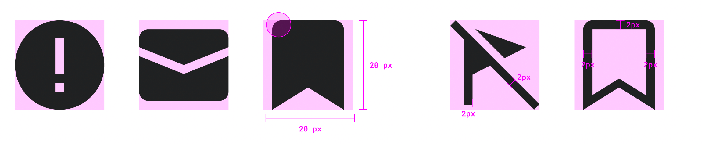
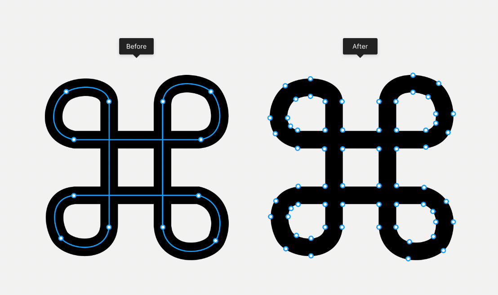
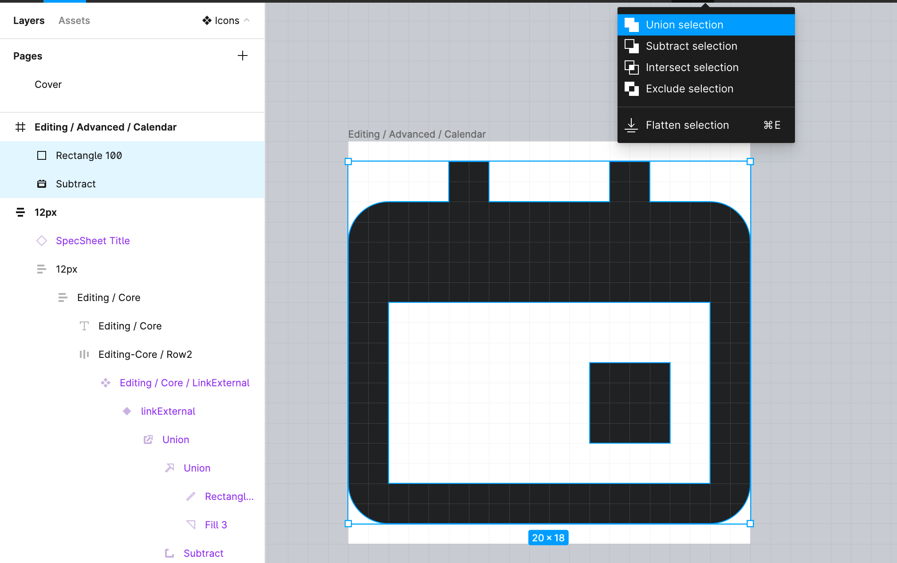
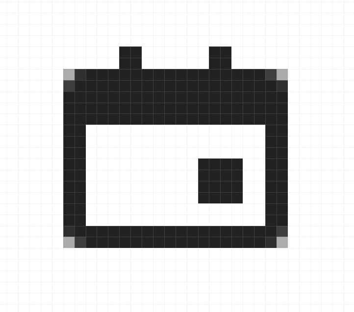
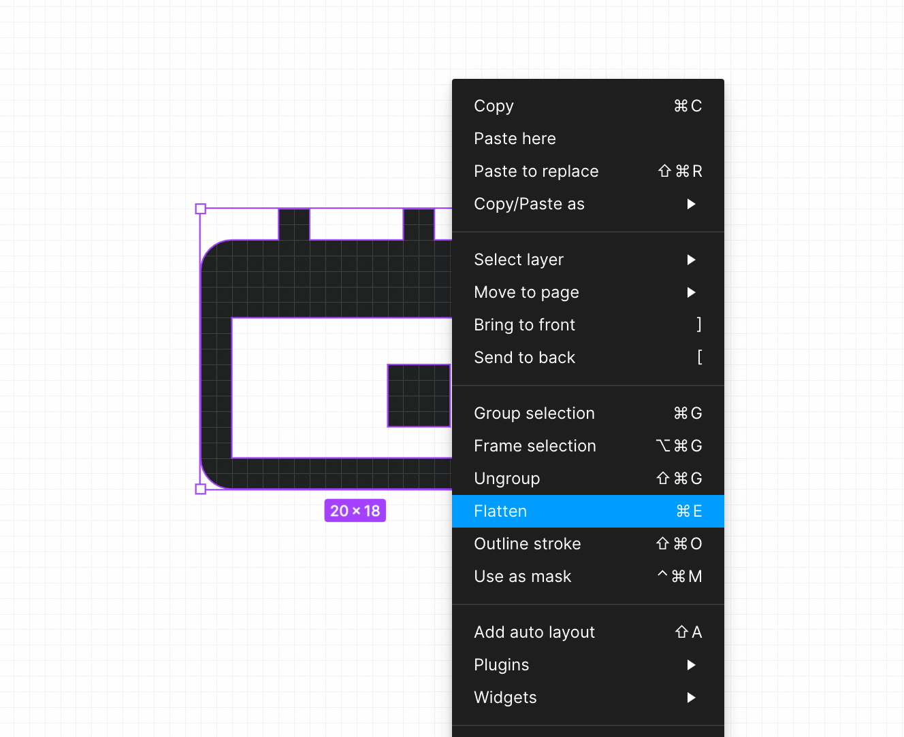
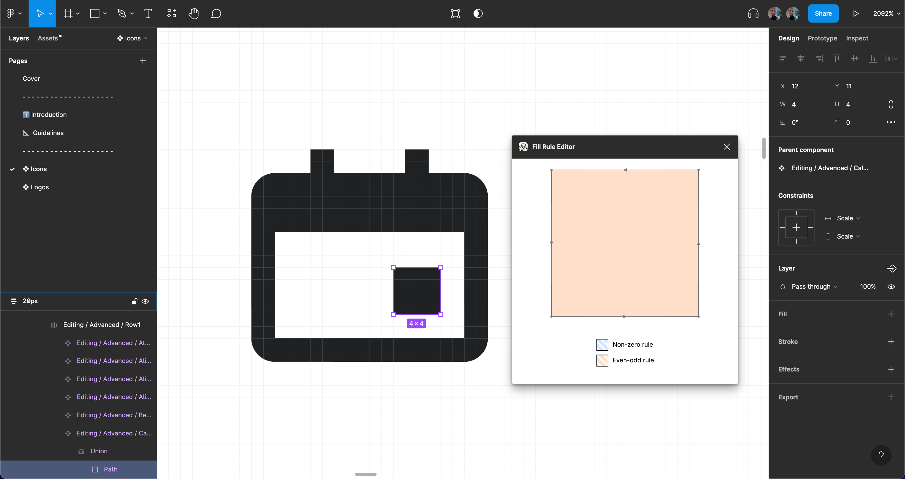

<script setup>
import { CdxIcon } from '@wikimedia/codex';
import {
	cdxIconListBullet,
	cdxIconListNumbered,
	cdxIconHelp,
	cdxIconBold
 } from '@wikimedia/codex-icons';

 const cdxIconListNumberedWronglyFlipped = {
	ltr: cdxIconListNumbered.ltr,
	shouldFlip: true
};
</script>

# Contributing icons

This page outlines the steps that collaborators should follow to contribute a new icon in Codex.

::: info
If you need support or have questions during the contribution process, reach out through one of the following channels:
- [Telegram](https://t.me/+oeXgL95hvgZiMDgx): If you are an external contributor, join the Codex Telegram channel.
- [Slack](https://wikimedia.enterprise.slack.com/archives/C03DKGSEPL2): If you're an internal contributor at the Wikimedia Foundation, join the Codex Slack channel for support and collaboration.
:::

## Reporting and validating

### File a task

In order to validate the need of this new icon, a new Phabricator task needs to be created. Use this [icon creation task template][icon-creation-phab-template] to file the task, and provide as much information as possible.

::: warning
Create a new icon only if none of the [existing icons](../icons/all-icons.md) meet your need.
:::

### Create an inventory

Collect and compare use cases to detect requirements. You can check the following relevant links in order to collect relevant information that can support the icon design process:

- [List of all icons](../icons/all-icons.md): to access all the existing icons in our system.
- [Codex Figma library](https://www.figma.com/design/KoDuJMadWBXtsOtzGS4134/Codex?node-id=20598-51339&node-type=frame&t=plW1hmguHVWs3fWZ-11): check the design of the Codex icons.
- [Style guide](../style-guide/icons): understand the visual style that the new icon should follow.
- [Wikimedia web products](https://www.wikimedia.org/): find current (and future) use cases where we use this icon.

### Validate the task

Make sure the task has been reviewed, validated, and approved before starting any work. This includes confirming that the new icon is truly needed.

Once the task is validated and the need is clearly established, you can move forward with the next steps in the contribution process.

## Designing the icon

### Follow Wikimedia’s guidelines

While designing the icon, follow the principles and visual styles described in our [style guide](../style-guide/icons). Wikimedia icons should be simple, neutral, monochromatic and front-facing.

Icons will be designed on a `20px` canvas, and be either solid or use a `2px` stroke if they’re outlined.



::: info
Duplicate this [icon exploration template](https://www.figma.com/design/bCNMpuclrDREgTnCLr34Si/Icon-design--exploration-file-template-?node-id=1-3627&p=f&t=UINHzWVjmVkyFaFq-11) to work on the icon's design if needed.
:::

### Create an RTL version (if needed)

Design an RTL (or mirrored) version of the icon in case it represents horizontal directionality, lists or text. Refer to the [Bidirectionality](../style-guide/bidirectionality.md) guidelines to read more about how to mirror icons.

<cdx-demo-best-practices>
<cdx-demo-best-practice>

Mirror icons with horizontal orientation, like the `cdxIconArrowNext` and `cdxIconArrowPrevious`

</cdx-demo-best-practice>
<cdx-demo-best-practice>

Mirror icons that represent lists or text.

</cdx-demo-best-practice>
<cdx-demo-best-practice type="dont">

Do not mirror Icons lacking clear directionality, as well as icons representing time, containing check symbols, or designed for right hand use

</cdx-demo-best-practice>
<cdx-demo-best-practice type="dont">

Do not mirror question mark icons or media icons such as play, pause, or rewind.

</cdx-demo-best-practice>
</cdx-demo-best-practices>

::: info
Share the icon proposal in the Phabricator task to gather feedback and iterate as needed.
:::

### Prepare for implementation

#### Optimize the icon

Make sure the icon meets the following requirements before exporting it:

<div class="cdx-docs-col cdx-docs-col-start cdx-docs-col-m">

1. Icon strokes are outlined and converted to vector paths (learn [how to do it](https://help.figma.com/hc/en-us/articles/360049283914-Apply-and-adjust-stroke-properties#convert))
</div>
<div class="cdx-docs-col cdx-docs-col-end cdx-docs-col-m">


</div>
<div class="cdx-docs-col cdx-docs-col-start cdx-docs-col-m">

2. All the shapes in the icon have been merged using [union selection](https://help.figma.com/hc/en-us/articles/360039957534-Boolean-Operations#:~:text=Union%3A%20Union%20combines%20the%20selected,segments%20which%20overlap%20each%20other.).
</div>
<div class="cdx-docs-col cdx-docs-col-end cdx-docs-col-m">


</div>
<div class="cdx-docs-col cdx-docs-col-start cdx-docs-col-m">

3. The icon is pixel perfect. You can use the pixel preview (<kbd>Ctrl</kbd> + <kbd>P</kbd>/<kbd>Command</kbd> + <kbd>Shift</kbd> + <kbd>P</kbd>) to verify that the icon’s strokes fit within the pixel edges. This will help you verify that the icon is recognizable in low DPI resolutions.
</div>
<div class="cdx-docs-col cdx-docs-col-end cdx-docs-col-m">



</div>
<div class="cdx-docs-col cdx-docs-col-start cdx-docs-col-m">

4. Once the icon’s strokes have been converted to vector paths, merged with union selection and checked using pixel preview, the icon can be flattened to group all shapes into a single vector.
</div>
<div class="cdx-docs-col cdx-docs-col-end cdx-docs-col-m">


</div>
<div class="cdx-docs-col cdx-docs-col-start cdx-docs-col-m">

5. In order to ensure that the exported icon displays the right filling and empty spaces, you’ll have to use the plugin [Fill-Rule-Editor](https://www.figma.com/community/plugin/771155994770327940/Fill-Rule-Editor) to define the fill rules of the icon’s vector objects.
</div>
<div class="cdx-docs-col cdx-docs-col-end cdx-docs-col-m">


</div>

#### Export the icon as SVG

Once the icon has been optimized, export the icon uisng this [SVG Export Figma plugin](https://www.figma.com/community/plugin/814345141907543603/SVG-Export). This will make sure that the icon code is as small as possible without quality loss.

1. Find the SVG Export plugin using the “Plugins” section in Figma’s main menu and run it. Before exporting the icon, import the [preset “WikimediaUI” (download link for JSON file)](/SVG-export-Wikimedia-SVGO-preset.json). The import option is available from a menu in the “Presets” panel.
2. Apply the WikimediaUI SVGO presets to the icon to be exported, then proceed to export the icon using the “Export all” button

#### Share the SVG icon in the Phabricator task

Include the exported SVG in the “SVG icon” section of the task so developers can easily access it for Codex. To support implementation and future updates:

- Add a description in the “Proposal” section in the task's description to explain the icon’s design.
- Link the Figma exploration file in the “Design spec” section for easy reference.

## Implementing the icon

When adding a new icon, you should:
1. Add the SVG file(s) for the icon to the `packages/codex-icons/src/images/` directory
2. Optimize the SVG file(s)
3. Add the icon definition to `packages/codex-icons/src/icons.ts`

### Naming
The icon's name should describe the icon, not its application, e.g. "bell" instead of
"notification".

Icon files should be named with the icon name in lowerCamelCase, e.g. `fooBar.svg` or
`articleAdd.svg`. If there are multiple SVG files for the same icon, those are named `iconName-suffix.svg`, e.g. `imageAdd-rtl.svg` or `italic-i.svg` (more on this below).

The variable name of the icon definition in `packages/codex-icons/src/icons.ts` should be in
lowerCamelCase and consist of the prefix `cdxIcon` followed by the icon name, e.g.
`cdxIconArticleAdd` for the "articleAdd" icon. Icon definitions in this file are in alphabetical
order.

### SVG conventions
Follow these conventions when crafting SVG files for icons:
- Icons must be 20x20 pixels canvas. Set `width="20" height="20" viewbox="0 0 20 20"` on the `<svg>`
  tag.
- Icons should include a `<title>` tag with the name of the icon.
- Icons must be monochrome (only default black color), and should not hard-code this color. This
  means the `fill` attribute should not be used.

#### SVG optimization

Icons are also optimized using SVGO during the build process. Codex follows
[MediaWiki's SVG coding conventions](https://www.mediawiki.org/wiki/Manual:Coding_conventions/SVG),
which are captured in the `.svgo.config.js` configuration file in the `@wikimedia/codex-icons`
package root folder. Note that this optimization step *overwrites the icon files* in the
`src/images` directory, and removes any `<!-- comments -->` in the SVG files.

To optimize the new icon file(s), run `npm run minify:svg -w @wikimedia/codex-icons` in the root of
the `codex` repository. Be sure to commit the optimized file(s).

### How to add each type of icon

#### Simple unidirectional icons
For a simple icon that doesn't vary by directionality (LTR/RTL) or language, add a single SVG file named in lowerCamelCase, e.g. `articleAdd.svg`, to the `images/` directory. Add an icon definition to `icons.ts` that looks like this:

```ts
import svgArticleAdd from './images/articleAdd.svg';
export const cdxIconArticleAdd = svgArticleAdd;
```

#### Automatically flipped icons
Automatically flipped icons are icons whose RTL version is a perfect mirror image of the LTR version. For these icons, we only put the LTR version in the repository, and then tell the browser to flip the icon horizontally in RTL contexts.

<!--
	In the paragraph below, do not allow the <cdx-icon> tags to be at the start of the line!
	Icons at the start of a line are not inlined, but start a new paragraph, which we don't want.
-->
For example, `listBullet.svg ` contains the LTR version of the `listBullet` icon: <cdx-icon :icon="cdxIconListBullet" />.
In RTL contexts, the LTR version is displayed, but is mirrored horizontally: <cdx-icon :icon="cdxIconListBullet" dir="rtl" />.

For these icons, add a single SVG file named in lowerCamelCase, e.g. `listBullet.svg`, to the `images/` directory. This file contains the LTR version of the icon (but despite that, it doesn't have a `-ltr` suffix). Add an icon definition to `icons.ts` that looks like this:

```ts
import svgListBullet from './images/listBullet.svg';
export const cdxIconListBullet: IconFlipForRtl = {
	ltr: svgListBullet,
	shouldFlip: true
};
```

##### Per-language exceptions to automatic flipping
For some icons, certain RTL languages need to use the LTR version of an icon. For example, question marks are flipped in most RTL languages, but not in Hebrew and Yiddish, so icons like `help` (<cdx-icon :icon="cdxIconHelp" />) that depict a question mark should not be flipped in those languages. To indicate this, list the RTL languages in which the icon shouldn't be flipped in the `shouldFlipExceptions` property, like this:
```ts
import svgHelp from './images/help.svg';
export const cdxIconHelp: IconFlipForRtl = {
	ltr: svgHelp,
	shouldFlip: true,
	shouldFlipExceptions: [ 'he', 'yi' ]
};
```

#### Icons with different LTR and RTL versions
<!--
	In the paragraph below, do not allow the <cdx-icon> tags to be at the start of the line!
	Icons at the start of a line are not inlined, but start a new paragraph, which we don't want.
-->
For some icons, the RTL version isn't a simple mirror image of the LTR version. For example, the `listNumbered` icon looks like <cdx-icon :icon="cdxIconListNumbered" /> in LTR. Flipping it automatically would look wrong, because the numbers would be mirrored too: <cdx-icon :icon="cdxIconListNumberedWronglyFlipped" dir="rtl" />.
Instead, we need a separate SVG file for the RTL version of the icon: <cdx-icon :icon="cdxIconListNumbered" dir="rtl" />.

For these icons, add two SVG files to the `images/` directory named with `-ltr` and `-rtl`
suffixes, e.g. `listNumbered-ltr.svg` and `listNumbered-rtl.svg`. Add an icon definition to
`icons.ts` that looks like this:
```ts
import svgListNumberedLtr from './images/listNumbered-ltr.svg';
import svgListNumberedRtl from './images/listNumbered-rtl.svg';
export const cdxIconListNumbered: IconVariedByDir = {
	ltr: svgListNumberedLtr,
	rtl: svgListNumberedRtl
};
```

#### Icons with different versions per language
<!--
	In the paragraph below, do not allow the <cdx-icon> tags to be at the start of the line!
	Icons at the start of a line are not inlined, but start a new paragraph, which we don't want.
-->
Some icons look different in different languages, especially those based on letters. In many cases, several languages share the same version of the icon. For example, the "bold" icon looks like <cdx-icon :icon="cdxIconBold" lang="en" /> in Czech, English, Hebrew, Malayalam, Polish and Scottish, but like <cdx-icon :icon="cdxIconBold" lang="ru" /> in Kirghiz, Russian and Ukrainian, etc.

For these icons, add a separate SVG file for each version of the icon to `images/`, each with a suffix that describes the variant of the icon. For example, `bold-b.svg`, `bold-f.svg`, `bold-cyrl-zhe.svg`, etc. There may be many variants; the "bold" icon has 16.

In the icon definition in `icons.ts`, first import all the variant files in alphabetical order, then define which variant to use for which language, and the default variant to use for all other languages.

```ts
import svgBoldA from './images/bold-a.svg';
import svgBoldB from './images/bold-b.svg';
import svgBoldCyrlZhe from './images/bold-cyrl-zhe.svg';
// … many more …

export const cdxIconBold: IconVariedByLang = {
	langCodeMap: {
		cs: svgBoldB,
		en: svgBoldB,
		he: svgBoldB,
		ml: svgBoldB,
		pl: svgBoldB,
		sco: svgBoldB,
		ky: svgBoldCyrlZhe,
		ru: svgBoldCyrlZhe,
		uk: svgBoldCyrlZhe,
		// … many more …
	},
	// 'bold-a.svg' will be used for all other languages not listed above.
	default: svgBoldA
};

```

### Testing the new icon

#### Lint

After optimizing the SVG file(s), run `npm run lint -w @wikimedia/codex-icons` in the root of the `codex` repository. This will run `svglint` and will check your additions to `icons.ts`.

#### Testing locally

To check the new icon on the Codex docs site, run these commands from the root of the `codex` repository:

```bash
# Build the icons package.
npm run build -w @wikimedia/codex-icons

# Serve the docs site.
npm run doc:dev
```

Then you can visit `http://localhost:5173/icons/all-icons.html` to check the list of all icons,
including your new one.

## Reviewing and documenting

Once the icon implementation has been completed, the contributor will need to:

- **Design sign-off**: Confirm the new icon was implemented correctly.
- **Publish in Figma**: Add the approved icon to the [Codex Figma library](https://www.figma.com/design/KoDuJMadWBXtsOtzGS4134/Codex?node-id=1891-4420&node-type=canvas&t=plW1hmguHVWs3fWZ-11) for reuse in design projects. Due to [team permissions in Figma](https://help.figma.com/hc/en-us/articles/360039970673-Team-permissions), only designers in the Wikimedia Foundation Figma team can edit the library. If you are part of the team, create a Figma branch adding the new icon before publishing; if you are not, someone from the team will handle the publishing for you.

[icon-creation-phab-template]: https://phabricator.wikimedia.org/maniphest/task/edit/form/1/?title=%5BIconName%5D%3A%20Add%20%5BIconName%5D%20icon%20to%20Codex%20and%20OOUI&description=%23%23%20Background%0D%0A%0D%0ANOTE%3A%20%2F%2FWhen%20creating%20a%20component%20task%2C%20please%20try%20to%20fill%20out%20the%20entire%20Background%20section.%20The%20rest%20of%20the%20task%20description%20can%20be%20populated%20later.%2F%2F%0D%0A%0D%0A%20%20%20%20-%20**Description%3A**%20provide%20context%20about%20usage%20of%20the%20new%20icon%0D%0A%20%20%20%20-%20**History%3A**%20describe%20or%20link%20to%20prior%20discussions%20related%20to%20this%20icon%0D%0A%20%20%20%20-%20**Known%20use%20case(s)%3A**%20describe%20known%20use%20cases%20for%20this%20icon%2C%20including%20the%20project%20and%20team%20where%20you%20will%20use%20this%20icon%20(and%20timeline%20if%20needed)%0D%0A%20%20%20%20-%20**Considerations%3A**%20list%20any%20known%20challenges%20or%20blockers%2C%20or%20any%20other%20important%20information%0D%0A%0D%0A%23%23%23%20User%20stories%0D%0A%0D%0A%2F%2FAdd%20at%20least%20one%20user%20story%20in%20the%20task%2F%2F%0D%0A%0D%0A%23%23%23%20Open%20questions%0D%0A%0D%0A%2F%2F%20Add%20here%20the%20questions%20to%20be%20answered%20in%20order%20to%20design%20and%20implement%20the%20component%20%2F%2F%0D%0A%0D%0A%23%23%23%20Design%20proposal%0D%0A%0D%0A%2F%2FOnce%20the%20icon%20proposal%20has%20been%20defined%2C%20it%20will%20be%20explained%20in%20this%20section%2C%20so%20any%20user%20can%20easily%20find%20and%20understand%20it.%2F%2F%0D%0A%0D%0A%23%23%23%20SVG%20icon%0D%0A%0D%0A%2F%2FOnce%20the%20icon%20has%20been%20created%2C%20we%20will%20export%20it%20in%20SVG%20format%20and%20add%20it%20here.%2F%2F%0D%0A%0D%0A%23%23%23%20Acceptance%20criteria%20for%20Done%0D%0A%0D%0A**Design**%0D%0A%20%0D%0A%5B%20%5D%20%20The%20design%20of%20the%20new%20icon%20is%20ready%2C%20and%20it%20follows%20the%20%5Bicon%20guidelines%5D(https%3A%2F%2Fdoc.wikimedia.org%2Fcodex%2Flatest%2Fstyle-guide%2Ficons.html)%0D%0A%20%20%20%5B%20%5D%20%20An%20RTL%20icon%20has%20been%20created%20%2F%2F(if%20needed)%2F%2F%0D%0A%20%20%20%5B%20%5D%20%20The%20icon%20is%20recognizable%20on%20low%20DPI%20resolutions%0D%0A%20%20%20%5B%20%5D%20%20The%20icon%20has%20been%20exported%20as%20an%20optimized%20SVG%20and%20added%20to%20this%20task%E2%80%99s%20description%0D%0A%20%20%20%5B%20%5D%20%20The%20new%20icon%20has%20been%20included%20and%20published%20in%20the%20%5BCodex%20Figma%20library%5D(https%3A%2F%2Fwww.figma.com%2Fdesign%2FKoDuJMadWBXtsOtzGS4134%2FCodex%3Fnode-id%3D20598-51339%26t%3DCLcY4nY3roYuHgVq-11)%0D%0A%20%20%20%20%0D%0A**Code**%0D%0A%0D%0A%5B%20%5D%20%20Add%20icon%20in%20Codex%0D%0A%5B%20%5D%20%20Add%20icon%20in%20OOUI%0D%0A%0D%0A%0D%0A**Documentation**%0D%0A%5B%20%5D%20Update%20%7BT141801%7D&projects=Codex%2C%20OOUI
