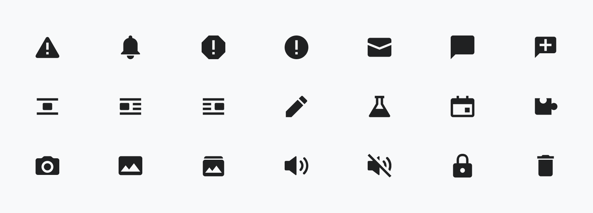
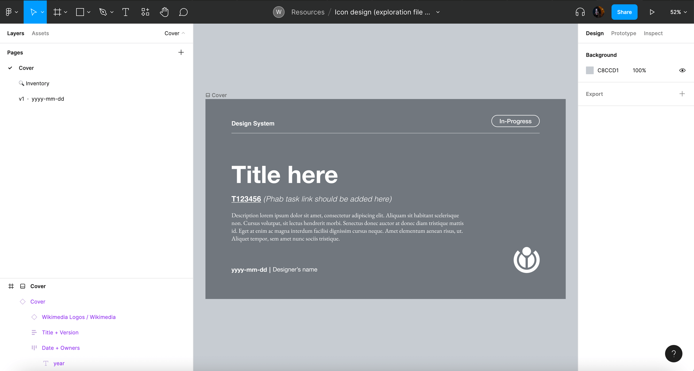
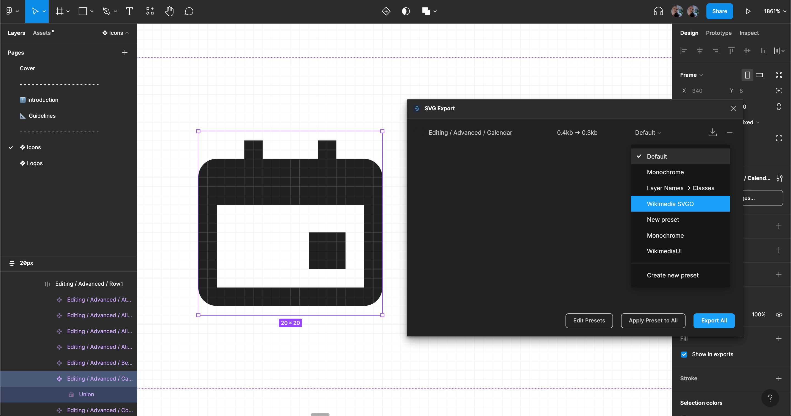
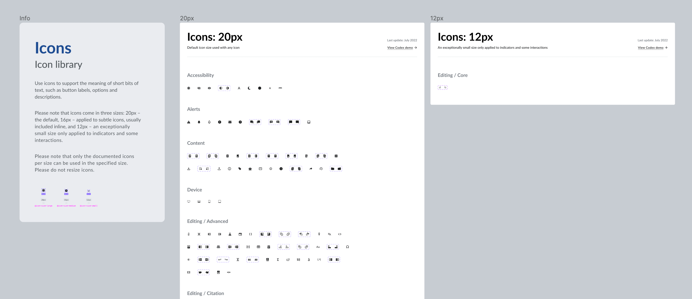

# Designing icons

This page outlines the steps that collaborators should follow to contribute a new design or design improvement to Codex’s icon library.

## 1. Report and validate

### 1.1. Create a new task in Phabricator

In order to validate the need to design or redesign an icon for the Codex design system, a new Phabricator task needs to be created. Use this [icon creation task template][icon-creation-phab-template] to file the task, and provide as much information as possible.

### 1.2. Review the task with the Design System Team (DST)

The task must be reviewed with the DST before starting to design the icon to clarify that this new icon is really necessary or if it can be covered with another system solution (e.g. with another icon from our set). Apart from adding the `Design-System-Team` project tag in the task, you can also post a comment once the task has been created and ping the DST  there so you can start discussing the need of this new icon with them.

Once the task is validated with the DST and the need of the new icon is clear you can start designing the icon.

## 2. Research and prepare

Start by observing and comparing the new and current use cases of the icon to guide your design process and ensure that the new element is as conveniently reusable as possible. You can check the following relevant links in order to collect relevant information that can support the icon design process:

- [List of all icons](../icons/all-icons.md): to access all the existing icons in our system.
- [Icon Library Figma file](https://www.figma.com/file/1lT9LKOK6wiHLnpraMjP3E/%E2%9D%96-Icon-System?node-id=0%3A1): check the design of our system's current icons.
- [Style guide](../style-guide/icons): understand the visual style that the new icon should follow.
- Wikimedia web products: find current (and future) use cases where we use this icon.

Collect and compare use cases to detect requirements. Detect similar icons and consider their properties: they should influence design decisions to make the new icon consistent with the rest of icons in our iconography.

## 3. Design the icon

### 3.1. Create a new exploration file in Figma

::: info
Please note that the use of Figma is not mandatory. Contributors are free to use their design tool of choice to design icons. Nevertheless, the icon will need to be imported to Figma in order to make it available to designers through the Codex Figma icon library.
:::

Create a new design exploration file in Figma so that different proposals and versions of the new icon are located in a central place. You can duplicate this [icon exploration template](https://www.figma.com/file/x8sZ7Z4ywQ0o1cQzaIJo8N/Icon-design-(exploration-file-template)?node-id=1%3A3627) and use it to create your own exploration file. The different iterations will be shared in the Phabricator task.

Include the following information in the design exploration file:

- **Cover:** contains a title, description, Phabricator task link and the task owner.
- **Inventory** *(if needed)* to collect and analyze the real use cases of the icon collected during the research phase.
- **Versioning**: Create a new Figma page for every new version of the icon. Indicate the version (e.g. “v1”) and date (e.g. “2022-07-17”) and an icon to indicate if the version is final (✅), archived (📁) or work-in-progress (WIP 🛠).

### 3.2. Design the icon following Wikimedia’s guidelines

While designing the icon, follow the principles and visual styles described in our [style guide](../style-guide/icons). Wikimedia icons should be simple, neutral, monochromatic and front-facing.

Icons will be designed on a 20px canvas, and be either solid or use a 2px stroke if they’re outlined.

### 3.3. Create an RTL version (if needed)

Design an RTL (or mirrored) version of the icon in case it represents horizontal directionality, lists or text.

<cdx-demo-rules>
<template #do-media>

</template>
<template #do-text>

- Mirror icons that represent horizontal directionality.
- Mirror icons that represent lists or text.

</template>
<template #dont-media>

</template>
<template #dont-text>

- Mirror icons that represent time.
- Mirror check icons.
- Mirror icons that represent objects usually held with the right hand (like a pencil or magnifying glass icon).
- Mirror icons with question marks; icons will not be mirrored in Hebrew but will be mirrored in Arabic.

</template>
</cdx-demo-rules>

### 3.4. Evaluate & iterate

Once the new icon proposal has been defined in the design exploration file, it should be shared in the relevant Phabricator task in order to collect feedback from the Design System team, other designers and community members. The icon proposal (or proposals) will be discussed in Phabricator in order to make a consensus decision. Iterations will be carried on if needed.

::: warning
Icons shouldn’t be added to the system unless they’re validated by the Design System team. The new design proposal will need to be reviewed with help from a system designer. Post a comment in the Phabricator task and ping system designers there, so they can review the icon and track the task.
:::

## 4. Hand-off to development

### 4.1. Document the design specifications in the Phabricator task description

Once there’s agreement on the icon design proposal, the new icon will be documented in the Phabricator task description, so contributors can easily find it when reviewing the task:

- Describe the design proposal in the “Proposal” section, so anyone can easily find and understand the specifications of the new icon.
- Add a link to the Figma exploration file in the “Design spec” section in the task description, so the file can be easily accessed.

### 4.2 Export the new icon as SVG

#### 4.2.1. Prepare the icon for export

Make sure the icon meets the following requirements before exporting it:

1. Icon strokes are outlined and converted to vector paths (learn [how to do it](https://help.figma.com/hc/en-us/articles/360049283914-Apply-and-adjust-stroke-properties#convert))

2. All the shapes in the icon have been merged using [union selection](https://help.figma.com/hc/en-us/articles/360039957534-Boolean-Operations#:~:text=Union%3A%20Union%20combines%20the%20selected,segments%20which%20overlap%20each%20other.).

3. The icon is pixel perfect. You can use the pixel preview (<kbd>Ctrl</kbd> + <kbd>P</kbd>/<kbd>Command</kbd> + <kbd>Shift</kbd> + <kbd>P</kbd>) to verify that the icon’s strokes fit within the pixel edges. This will help you verify that the icon is recognizable in low DPI resolutions.

4. Once the icon’s strokes have been converted to vector paths, merged with union selection and checked using pixel preview, the icon can be flattened to group all shapes into a single vector.

5. In order to ensure that the exported icon displays the right filling and empty spaces, you’ll have to use the plugin [Fill-Rule-Editor](https://www.figma.com/community/plugin/771155994770327940/Fill-Rule-Editor) to define the fill rules of the icon’s vector objects.

#### 4.2.2. Export the icon

Export the optimized version of the icon with help from Figma’s [SVG Export plugin](https://www.figma.com/community/plugin/814345141907543603/SVG-Export). This will make sure that the icon code is as small as possible without quality loss.

1. Find the SVG Export plugin using the “Plugins” section in Figma’s main menu and run it. Before exporting the icon, please import the [preset “WikimediaUI” (download link for JSON file)](/SVG-export-Wikimedia-SVGO-preset.json). The import option is available from a menu in the “Presets” panel.

2. Apply the WikimediaUI SVGO presets to the icon to be exported, then proceed to export the icon using the “Export all” button

#### 4.2.3. Attach the SVG icon to the Phabricator task

The exported SVG icon will be included within the “SVG icon” section in the task description, so developers can easily find it once they need to add it to the Codex icon repository.

### 4.3. Complete the design checklist and notify the developer

Make sure to complete and check all the items in the Design checklist included under the  Acceptance criteria section of the icon design task.

Once the design checklist is complete, add a comment in the Phabricator task and **ping the Design System Team** to assign a developer in charge of adding the new icon or icon version to the Codex repository, so they can take over the task.

## 5. Design sign-off

Once the developer completes the task of adding the new icon to the Codex repository, they will move the task to the “Design Sign-Off” column in the Design System Team Phabricator board.

At that point, the task should be assigned back to the designer of the icon, so they can verify that it was created successfully.

Once the design sign-off is completed, the designer will provide feedback in a comment and move the task to the “Product sign-off” column so that the change can be approved before the final release of the icon.

## 6. Document: Add the new icon to the Figma library

Once the icon has been released as part of the Codex library, it will be included in the main [Icon Library](https://www.figma.com/file/1lT9LKOK6wiHLnpraMjP3E/%E2%9D%96-Icon-System?node-id=1474%3A1275) in Figma by the Design System Team. This will make the icon available for reuse in the design projects consuming the icon library.

::: info
The icon will be added and published in the Figma library by a Design System member in order to avoid problems with current components and instances. Ping system designers in the relevant Phabricator task and share with them your [design exploration file](#_2-design-the-icon), so they can add the icon in the [Icon Library](https://www.figma.com/file/1lT9LKOK6wiHLnpraMjP3E/%E2%9D%96-Icon-System).
:::

[icon-creation-phab-template]: https://phabricator.wikimedia.org/maniphest/task/edit/form/1/?title=%5BIconName%5D%3A%20Add%20%5BIconName%5D%20icon%20to%20Codex%20and%20OOUI&description=%3D%3D%3D%20Background%20%26%20Goal%0D%0A%20%20%20%20-%20**Description%3A**%20provide%20context%20about%20usage%20of%20the%20new%20icon%0D%0A%20%20%20%20-%20**History%3A**%20describe%20or%20link%20to%20prior%20discussions%20related%20to%20this%20icon%0D%0A%20%20%20%20-%20**Known%20use%20case(s)%3A**%20describe%20known%20use%20cases%20for%20this%20icon%2C%20including%20the%20project%20and%20team%20where%20you%20will%20use%20this%20icon%20(and%20timeline%20if%20needed)%0D%0A%20%20%20%20-%20**Considerations%3A**%20list%20any%20known%20challenges%20or%20blockers%2C%20or%20any%20other%20important%20information%0D%0A%0D%0A%3D%3D%3D%20User%20stories%0D%0A%2F%2FAdd%20at%20least%20one%20user%20story%20in%20the%20task%2F%2F%0D%0A%0D%0A%3D%3D%3D%20Considerations%20%2F%2F(Optional)%2F%2F%0D%0A%0D%0A%3D%3D%3D%20Open%20questions%20%2F%2F(Optional)%2F%2F%0D%0A%0D%0A%3D%3D%3D%20Proposal%0D%0A%2F%2FOnce%20the%20icon%20proposal%20has%20been%20defined%2C%20it%20will%20be%20explained%20in%20this%20section%2C%20so%20any%20user%20can%20easily%20find%20and%20understand%20it.%2F%2F%0D%0A%0D%0A%3D%3D%3D%20Design%20spec%0D%0A%2F%2FOnce%20the%20icon%20spec%20sheet%20has%20been%20created%2C%20the%20Figma%20file%20should%20be%20included%20here.%2F%2F%0D%0A%0D%0A%3D%3D%3D%20SVG%20icon%0D%0A%2F%2FOnce%20the%20icon%20has%20been%20created%2C%20we%20will%20export%20it%20in%20SVG%20format%20and%20add%20it%20here.%2F%2F%0D%0A%0D%0A%3D%3D%3D%20Acceptance%20criteria%20for%20Done%0D%0A%0D%0A**Design**%0D%0A%20%0D%0A%20%20%20%20%5B%20%5D%20%20The%20design%20of%20the%20new%20icon%20is%20ready%2C%20and%20it%20follows%20our%20%5Bicon%20system%20guidelines%5D(https%3A%2F%2Fdoc.wikimedia.org%2Fcodex%2Flatest%2Fstyle-guide%2Ficons.html)%0D%0A%20%20%20%20%5B%20%5D%20%20The%20new%20icon%20has%20been%20reviewed%20with%20help%20from%20the%20DST%0D%0A%20%20%20%20%5B%20%5D%20%20An%20RTL%20icon%20has%20been%20created%20%2F%2F(if%20needed)%2F%2F%0D%0A%20%20%20%20%5B%20%5D%20%20The%20icon%20is%20recognizable%20on%20low%20DPI%20resolutions%0D%0A%20%20%20%20%5B%20%5D%20%20The%20icon%20has%20been%20exported%20as%20an%20optimized%20SVG%20and%20added%20to%20this%20task%E2%80%99s%20description%0D%0A%20%20%20%20%5B%20%5D%20%20The%20new%20icon%20has%20been%20included%20and%20published%20in%20our%20%5BIcon%20System%20Figma%20library%5D(https%3A%2F%2Fwww.figma.com%2Ffile%2F1lT9LKOK6wiHLnpraMjP3E%2F%25E2%259D%2596-Assets-(Icons%252C-Logos%252C-Illustrations)%3Ftype%3Ddesign%26node-id%3D3295-13631%26t%3D7enEmmEPJCTCpfRG-11)%0D%0A%20%20%20%20%0D%0A**Code**%0D%0A%0D%0A%20%20%20%20%5B%20%5D%20%20Add%20icon%20in%20Codex%0D%0A%20%20%20%20%5B%20%5D%20%20Add%20icon%20in%20OOUI%0D%0A%0D%0A%0D%0A**Documentation**%0D%0A%20%20%20%20%5B%20%5D%20Update%20%7BT141801%7D&projects=Design-System-Team%2C%20Codex%2C%20OOUI%2C%20Design

