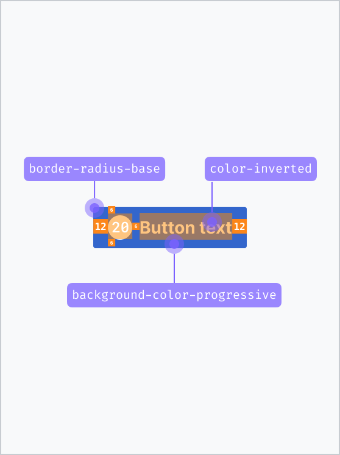
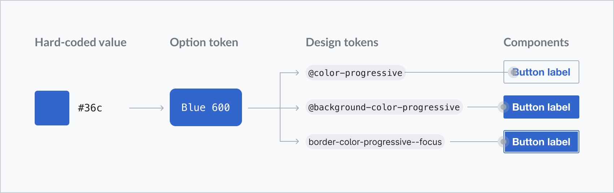
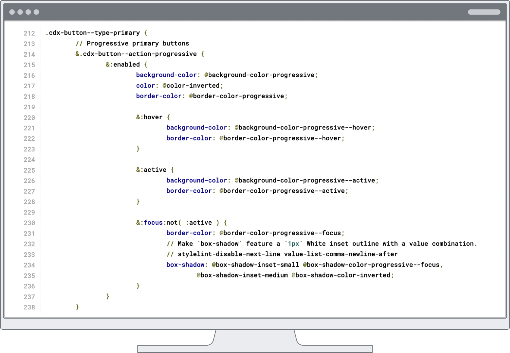

# Definition and Structure

## 1. What are design tokens?

Design tokens are the smallest units that store the visual guidelines and design
decisions that characterize our system. More importantly, tokens document the
intended context of use assigned to a specific style, and enable the application
of the correct visual value to a specific component property. This is how tokens
help to bridge the gap between implementation and design.

Tokens are used to:

1. **Define the visual style of components**: since tokens capture the system’s
stylistic attributes, they provide guidance to define the styles (background
colors, text formatting, sizes, spacing…) of new system components from scratch.

2. **Codify design styles**: Designers use tokens to specify all the visual
styles and interactive properties of a given component. These design decisions
are translated to code. For more details regarding the use of design tokens for
design specification, refer to the section dedicated to specification
hand-off to development in the [Designing Components](../contributing/designing-new-components.md)
documentation.

### From visual styles to tokens in design and code
Design system components are made up of a combination of predefined perceptual
patterns. These patterns result from the consistent application of preselected
styles such as colors, shadows, or spacing values, to specific UI elements and
properties like backgrounds, borders, or paddings.

At its core, Codex is made up of a set of visual styles derived from the
[style guide](../style-guide/overview) principles. Colors, typography, shadows
and spacings are aligned with the style guide, and documented as tokens in the
system. Design tokens are thus the smallest building blocks of the system: they
define, document and enable the application of systemic design decisions at
scale.

### Token typologies

There are three types of tokens, depending on their function and level of
abstraction:

#### Option tokens (aka theme options)
Option tokens are context-agnostic tokens that encapsulate the primitive visual
foundations of the system. Their name does not reflect a specific use case,
rather they use the simplest possible name. They have raw values, e.g.
`color-blue500: #447ff5`

Option tokens are not used to style components. Their only purpose is to
document raw values, and to be consumed by the next token typology: decision
tokens.

Option tokens are captured in the theme specific JSON file: `themes/wikimedia-ui.json`

#### Decision tokens (aka application tokens or base tokens)

Decision tokens consume option tokens as values. They represent design decisions
that can be reused to style system components. For this reason, decision tokens
are documented in our [Codex token demo](./color.md). They communicate their
intended use case via their name (so are not agnostic, like option tokens), e.g.
`box-shadow-medium: { box-shadow.outset.medium-below } { box-shadow.color.alpha }, { box-shadow.outset.medium-around } { box-shadow.color.alpha }`.

Decision tokens are used to style system components and elements. This set of
tokens is documented in the JSON file `application.json`.

##### Modes (theme variants)
A given Codex theme may also optionally support one or more variants, called
"modes". For example, a dark or high-contrast color mode might override certain
color tokens defined in `application.json` with alternate values drawn from the
same set of option tokens. For more information about how Codex will represent
modes, visit [ADR 08](../using-codex/adrs/08-adr-color-modes.md).

#### Component decision tokens
In the context of Codex, component tokens are used to document and define
specific component styles that cannot be documented as shared decisions due to
their single-use application. The names of component tokens include the name of
the specific component and the property they define. Like decision tokens, they
consume option tokens as values, e.g. `color-link-red--visited: color.maroon500`.

Component tokens embody exceptions, and are directly applied to style specific
component properties. If a pattern arises (i.e. the component token can be used
by several components), the  single-use component token can be converted into a
decision token.

Component tokens are documented in a dedicated `components.json` file.

## 2. Tokens in design

### From design to implementation
Designers can access an overview of Codex foundational styles and principles, along with their token translation, in the
[Codex Figma library](https://www.figma.com/design/KoDuJMadWBXtsOtzGS4134/Codex?node-id=1891-4420&node-type=canvas&t=plW1hmguHVWs3fWZ-11). By enabling this library in their project’s Figma files,
designers can reuse the Codex visual principles as Figma styles and variables when creating components and compositions.

::: info
Please note that tokens are context-specific: use them accordingly to the
intended purpose expressed by their name. E.g. Apply content colors only to
text.
:::

During implementation, engineers will be able to follow the design
specifications in Figma (whether these are presented explicitly, or via the
Inspect panel) and use the correct design tokens as values of the component’s
CSS properties.

Please find all current design system token category demos in this section of
the Codex docs, starting at [Animation](animation.md) and ending at
[Z-Index](z-index.md).

## 3. Tokens in code
### File organization
Codex token files are structured to cater to Wikimedia's multi-theme,
multi-mode environment. Base tokens apply the theme-agnostic named tokens from
`themes` JSON files across components and patterns. Single component tokens also
apply theme-agnostic named tokens.

1. **Theme tokens (`themes/*.json` files): Design options** 
Themes are defined in JSON files with theme-agnostic keys and theme-specific
values. Theme tokens are not meant to ever be directly applied in Codex
stylesheet rules for components or patterns. They are only the internal pool of
design options for the decisions represented by base and component tokens.

2. **Base tokens (`application.json` and `modes/*.json`): Design decisions** 
The base tokens `application.json` file and the component tokens
`components.json` file are featuring the design decisions. All token keys follow
a more semantic, developer-friendly naming scheme, where values from the
design options token pool above are applied into decisions. Base tokens are used
across various components. If mode-specific overrides have been defined, they
should live in `modes/*.json` files; these files will contain a subset of the
base tokens (using the same names) and will provide new values (drawing from
different option tokens within the same theme).

3. **Component tokens (`components.json`): Design decisions** 
The component tokens `components.json` file collects only single-component
design decisions, that are not covered by the base tokens. All component tokens
carry the single-file-component name in their name after the token category, for
example `background-color-button-quiet--hover`.  
Important reasons for separating component from base tokens are to support
identifying consistency gaps and emerging design patterns across components or
to surface very close values for combination later.

### Naming and definition structure
To create an extensible structure that is easily understood by humans, we follow
these rules when naming tokens:

- The JSON keys follow CSS property names for the sake of familiarity and
  readability. They follow by and large
  [variable naming patterns established for MediaWiki](https://www.mediawiki.org/wiki/Manual:Coding_conventions/CSS#Variable_naming).
  For example, we use `{ font-weight.100 }` instead of `{ font.weight.100 }`.
  There are a few category naming exceptions like `size` and `spacing` tokens, in
  order to reuse them in different property contexts – as values in `width`,
  `height`, `padding` and so on.
- The name describing the CSS property or category value always comes first,
  which makes it obvious when a token is improperly applied to a different
  property, e.g. ~~`color: @background-color-base`~~.
- Tokens with numerical values are centered around a default key of `100`. This
  is critical to creating a structure that is flexible and theme-agnostic. For
  example, base size is defined by `{ dimension.100 }`, which could be used to
  define a default theme base font size of `16px`, or a theme-specific base font
  size of `14px`, depending on what theme the size token is set to. Because the
  names of the design tokens do not refer to a specific value, they can be reused
  by both the default and other themes.

### Further technical notes
- Note, that normalization and reset values like `0` or `none` are not tokenized
  as they aren't used for design decisions. 
  `box-shadow: none` or `z-index: 0` on the other hand are representing design
  decisions.
- We're not using [Style Dictionary's predefined transform groups](https://github.com/amzn/style-dictionary/blob/main/docs/transform_groups.md)
  for all stylesheet formats (CSS, Less and Sass) in order to keep precise
  control over output. For cross-browser support, we rely on a variety of output
  values for different applications (example: `transparent` over 'color/css'
  output hexadecimal color `#00000000`) and also deliver small performance gems
  like hex color shorthands.
