# Bidirectionality

Bidirectionality supports the mirroring of a user interface to support both languages read from left-to-right (LTR) and those read from right-to-left (RTL).[[1]](#ref1)

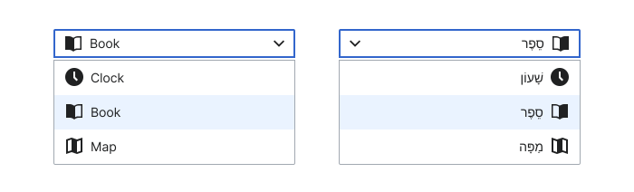

Languages with left-to-right directionality (LTR) are those with Latin script (English, Spanish, French, German, etc.), Cyrillic (as Russian and Bulgarian), Chinese and Japanese (they maintain their top-to-bottom and RTL in printing and writing, but they use the LTR system in digital experiences).[[2]](#ref2) Conversely, languages with right-to-left directionality (RTL), such as Arabic or Hebrew, are read from right to left.[[3]](#ref3)

## Mirroring behavior

When a layout translates from LTR to RTL, or vice versa, this process is called mirroring, as it essentially reflects the layout orientation of the opposite directionality.

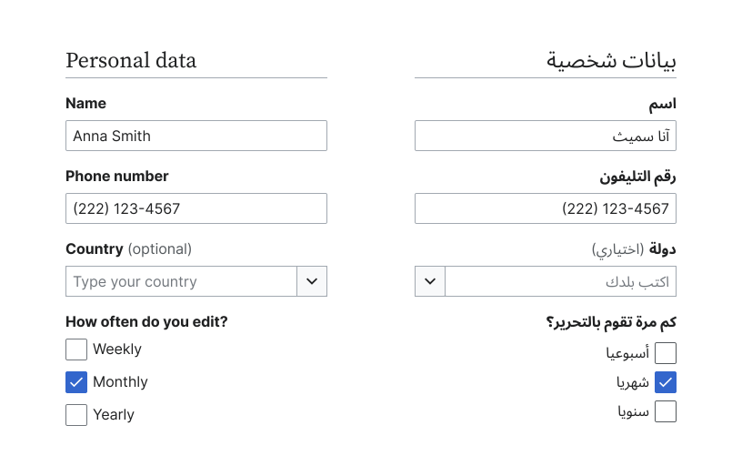

When mirroring a layout, it's important to note that not all elements in the interface will use the same mirroring treatment. Here's a list of elements that should and should not be mirrored:

**Do mirror:**
- Text from RTL languages
- Icons with horizontal orientation, like the `cdxIconArrowNext` and `cdxIconArrowPrevious`
- Elements within components and pages
- Buttons and group of buttons
- Sliders, toggle switches, and control elements
- Rating selectors
- Paginations
- Navigation items

**Don’t mirror:**
- Text from LTR languages
- Icons lacking clear directionality, as well as icons representing time, containing check symbols, or designed for right hand use
- Phone numbers and ZIP codes
- URLs and email addresses
- Components or elements representing time
- Charts and graphs if mirroring could impact data interpretation
- Currency symbols

## Text

The text should be oriented correctly according to the reading direction of each language.

<cdx-demo-rules>

<template #do-media>

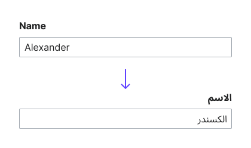

</template>

<template #do-text>

- Display text in the reading direction according to its language.
- Adjust alignment and spacing to keep visual consistency.

</template>

<template #dont-media>

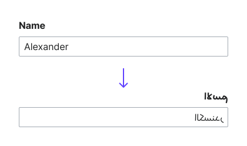

</template>

<template #dont-text>

- Translate text without considering the reading direction.
- Overlook cultural or linguistic nuances that may affect text presentation.

</template>

</cdx-demo-rules>

#### Paragraphs

In cases where we have both LTR and RTL languages in the same paragraph, we will align the text according to the original language of the browser or the selected article.

<cdx-demo-rules>

<template #do-media>

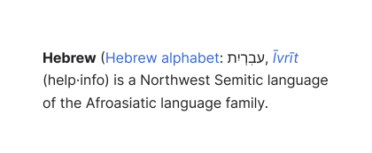

</template>

<template #do-text>

- Align text within paragraphs based on the language direction of the browser or the selected article.

</template>

<template #dont-media>

</template>

<template #dont-text>

- Align text within paragraphs in a direction different from that of the browser or article.
- Mix alignments within paragraphs containing LTR and RTL languages.

</template>

</cdx-demo-rules>

#### URL and email addresses

While text is typically mirrored in bidirectional interfaces, URLs and email addresses should remain unaltered. These elements have standardized structures and formats that are universally recognized. Mirroring them may disrupt their functionality, potentially causing errors or user misinterpretation.

<cdx-demo-rules>

<template #do-media>

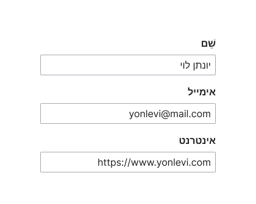

</template>

<template #do-text>

- Keep the structure and format of URLs and email addresses intact to ensure their readability and functionality.
- Align URLs and email addresses with the reading direction of each language.

</template>

<template #dont-media>

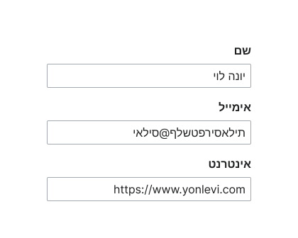

</template>

<template #dont-text>

- Mirror URLs and email addresses.
- Alter the format or structure of URLs and email addresses.

</template>

</cdx-demo-rules>

## Actions

When mirroring actions, ensure that both buttons and their accompanying icons, if they include directional movement, are mirrored to align with the reading direction of each language.

<cdx-demo-rules>

<template #do-media>

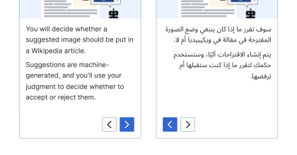

</template>

<template #do-text>

- Mirror the buttons to match the reading direction of each language.
- Use the RTL version of the button’s icon in case the icon features directional movement.

</template>

<template #dont-media>

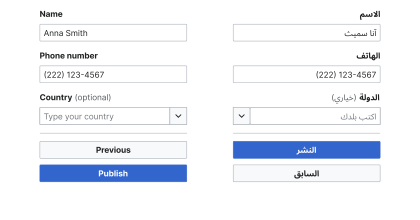

</template>

<template #dont-text>

- Rearrange the original position of the stacked buttons.

</template>

</cdx-demo-rules>

## Phone numbers

When adapting phone numbers for bidirectional design, the mirroring will vary based on the specific phone element being considered.

<cdx-demo-rules>

<template #do-media>

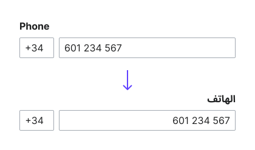

</template>

<template #do-text>

- Use LTR numbers in Western Arabic and RTL numbers in Eastern Arabic.

</template>

<template #dont-media>

</template>

<template #dont-text>

- Mirror international prefixes.
- Mirror phone numbers.

</template>

</cdx-demo-rules>

## Addresses

When applying mirroring to addresses, words will be mirrored, whereas numbers will remain unchanged.

<cdx-demo-rules>

<template #do-media>

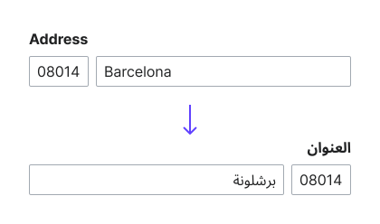

</template>

<template #do-text>

- Mirror the names of countries and cities to match the reading direction.
- Separate letters and numbers into different inputs to mitigate errors.

</template>

<template #dont-media>

</template>

<template #dont-text>

- Mirror ZIP codes or numerical data.

</template>

</cdx-demo-rules>

## Date and time

When adapting date and time components for bidirectional design, the sequence of date and time elements (such as day, month, year, and hour) will align with the reading direction of the language. However, numbers and icons representing time will not be mirrored.

<cdx-demo-rules>

<template #do-media>

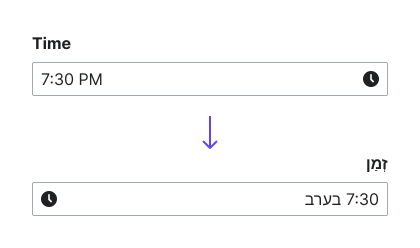

</template>

<template #do-text>

- Adapt date and time elements with each language's reading direction.
- Use the appropriate date and time formats for each language.

</template>

<template #dont-media>

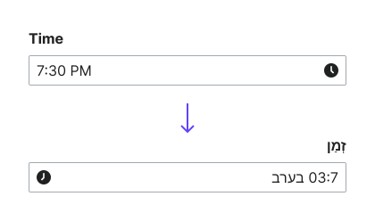

</template>

<template #dont-text>

- Mirror the order of date and time elements, as it may lead to confusion in interpretation.
- Mirror numerical values.
- Mirror icons representing time.

</template>

</cdx-demo-rules>

## Lists

In a list, all rows should align according to the language direction of the browser or the article.

<cdx-demo-rules>

<template #do-media>

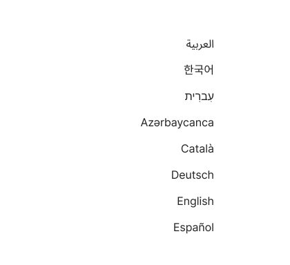

</template>

<template #do-text>

- Align all rows of the list according to the language direction of the browser or article.

</template>

<template #dont-media>

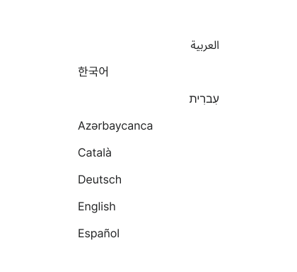

</template>

<template #dont-text>

- Mix alignments within a list, as this can cause confusion for readers.

</template>

</cdx-demo-rules>

## Progress indicators

When mirroring progress indicators, only the ones related to sequences should be mirrored.

<cdx-demo-rules>

<template #do-media>

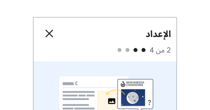

</template>

<template #do-text>

- Mirror progress indicators when they indicate progress or steps, aligning the sequence with the reading direction of each language for consistency.

</template>

<template #dont-media>

</template>

<template #dont-text>

- Mirror progress indicators when they relate to time, such as the timeline within a video player.

</template>

</cdx-demo-rules>

## Images

The original orientation of images and illustrations will not be mirrored. However, accompanying text, such as captions or adjacent text, will be aligned according to the reading direction of each language.

<cdx-demo-rules>

<template #do-media>

</template>

<template #do-text>

- Maintain the original orientation of images and illustrations.
- Adjust accompanying text or captions to match the reading direction of the language.

</template>

<template #dont-media>

</template>

<template #dont-text>

- Alter the orientation of images or illustrations, as it may change their intended meaning and context.

</template>

</cdx-demo-rules>

## Icons

Similar to other elements within the interface, icons can also be adapted to match the reading direction of each language, although not all icons require mirroring.

<cdx-demo-rules>

<template #do-media>

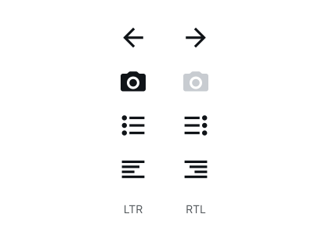

</template>

<template #do-text>

- Mirror icons that represent horizontal direction.
- Use the same icon for both LTR and RTL when the icon doesn’t include directional indicators.
- Mirror icons that contain lists to maintain consistency and readability.
- Use the LTR version of certain icons in RTL languages when appropriate, such as the question mark in Hebrew versus Arabic.

</template>

<template #dont-media>

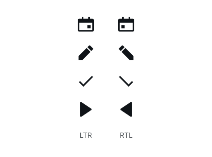

</template>

<template #dont-text>

- Mirror icons that represent time, such as clocks or calendars.
- Mirror icons designed to be held with the right hand to maintain their intended orientation.
- Mirror icons containing check symbols to ensure their universal recognition remains consistent.
- Mirror media icons such as play, pause, or rewind.

</template>

</cdx-demo-rules>

Refer to the [list of icons](../icons/all-icons.md) to know which ones include mirroring behavior.

## References

1. [Bidirectional text on English Wikipedia](https://en.wikipedia.org/wiki/Bidirectional_text)
2. [Directionality within Writing sytem on English Wikipedia](https://en.wikipedia.org/wiki/Writing_system#Directionality)
3. [Right-to-left script on English Wikipedia](https://en.wikipedia.org/wiki/Right-to-left_script)