# Constructing forms

An overarching guide for constructing forms using Codex. A form consists of at least one Field.

## Usability, accessibility, and inclusion

Making forms to be as usable, accessible, and inclusive as possible is not only important from a perspective of ethics but also increases the success of a form. The number one goal of a form is to have a user complete and submit their inputs with comfort and confidence.
1. Make fields as simple as possible: Don’t overthink or complicate the purpose or functionality of a field. Use existing components to solve data input needs.
2. Only gather the information that is absolutely necessary. For example, don’t ask for data such as an email address or gender unless it is absolutely needed.
3. When such information is necessary to collect, it is important to understand the differences between [sex and gender](https://en.wikipedia.org/wiki/Sex%E2%80%93gender_distinction).
4. Labels must be used with inputs to ensure that the label text is always visible while filling the input. Additionally, labels enhance the form's readability, aiding users in quickly scanning its contents.
5. Avoid using disabled buttons on forms and instead rely on [validation](#validation).
6. Avoid setting timers on the completion of a form. For example, forcing a user to fill in a form or field within a limited amount of time. This poses a concern on accessibility for all users.
7. Avoid hiding a form inside of an Accordion or other collapsible element, especially when filling out the form is required, no matter the size of the screen.
8. All fields in a form are inherently required. Consider omitting fields that don’t feel absolutely necessary, to emphasize this notion. When a field is optional, it should be accompanied by the word “(optional)” next to the label. This functionality is built into the [Label](../components/demos/label.md) component.

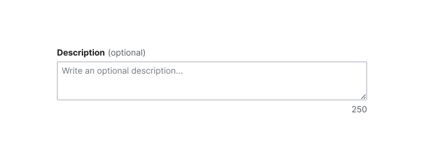

## Layout

### Width

A form and its fields should span the entire parent container of the page or container it is within. Where horizontal space is available and a form is long, consider breaking the form into intentional sections and use a table of contents. Fields may use a maximum width of `size-4000` (equivalent to `640px` in the default Codex theme) when a table of contents is not used. In either case, all fields should be the same width as one another, whether 100% of the container or page, or as set to a maximum width.

When other components exist within the form, but are not form elements such as fields, these components can span to 100% of the container, similar to the header and footer. Examples of such components are those which warrant more horizontal space, like a Table or [Accordion](../components/demos/accordion.md).

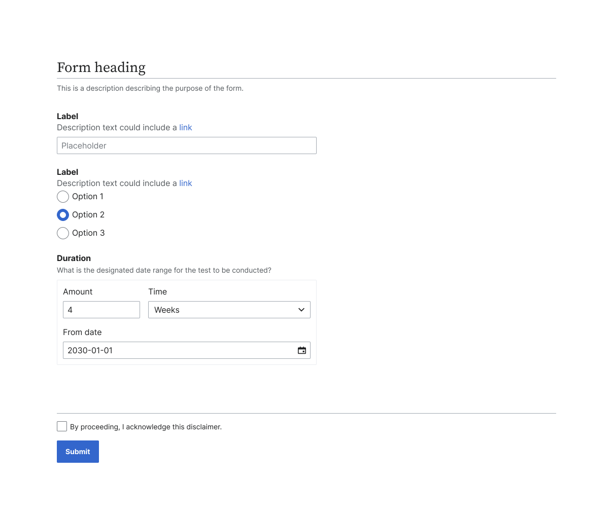

::: info
The header and footer of a form without a table of contents should remain 100% of the page width, even when the fields within the form have a maximum width.
:::

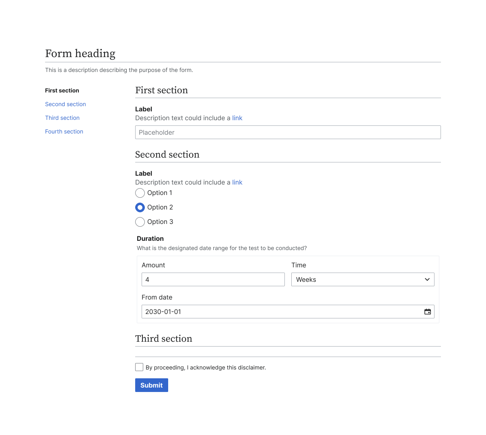

::: info
The header and footer of a form with table of contents will remain 100% of the form width.
:::

### Format

A form can utilize fields in multiple different formats including multi-columns, [fieldsets](../components/demos/field.md#fieldset-with-nested-fields), and modules (read more below). The font weight of the label can be changed as needed to represent different levels of hierarchy.

#### Labels

Fields use top labels to help promote the intended flow of reading a page visually. All inputs should have an associated label for accessibility purposes, as suggested in the guidelines for [Label](../components/demos/label.md). There are some instances where a [visually-hidden label](../components/demos/label.md#visually-hidden-label) can also be used.

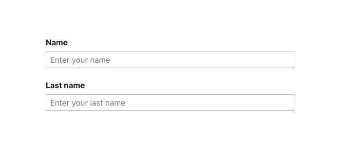

Multi-columns of fields in the same row can be used when:
- Fields are related (such as “Name” and “Surname” or “Phone” and “Email” or “Start date” and “End date”).
- Translation of language in input or label will not become very long.
- Avoid grouping related horizontal fields or multi-column fields of just one line within boxes. Instead use smaller spacing between fields.

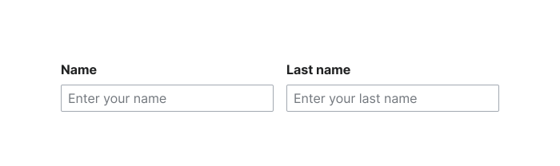

### Fieldsets

A fieldset is a group of related inputs used to provide a single response. [Checkbox](../components/demos/checkbox.md) and [Radio](../components/demos/radio.md) groups are classic examples of a fieldset. Fieldsets are built as a variant of the Field component for a group of related inputs inside a `<fieldset>` element with an associated `<legend>`.

### Modules

Modules around the entire form can be used to visually separate a form when accompanied by other elements on the page.

The most common style of modules use a border-radius of `2px`, or `border-radius-base`, a transparent background, and a border color of `border-color-muted`. Additionally, a `background-color-interactive-subtle`, can be used to emphasize the inputs within the module.

Modules can also be used to group related fields within groups or fieldsets (such as “Start date” and “End date” in a section called “Duration”). Multi-columns can be used within a module to group multiple directly related fields.

For groups with fields inside a module or grouped as a part of a fieldset, the parent label should use the font-weight of `bold` while standard labels on the fields inside the group use the font-weight `regular` to convey varying levels of hierarchy.

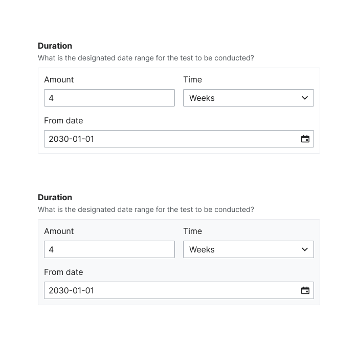

::: info
The visual example above shows a section called “Duration” and the fields, “Amount” and “Time” as a fieldset, with a separate, individual field below called “From date”.
:::

### Conditional and nested fields

Conditional fields appear as a result of another field or input within a field, and can be nested, or spatially indented, if desired.

When using a visually nested field that is spatially indented, each further nested field should be indented `16px` from its parent field. An example of this type of pattern can be found when creating a new function in Wikifunctions.

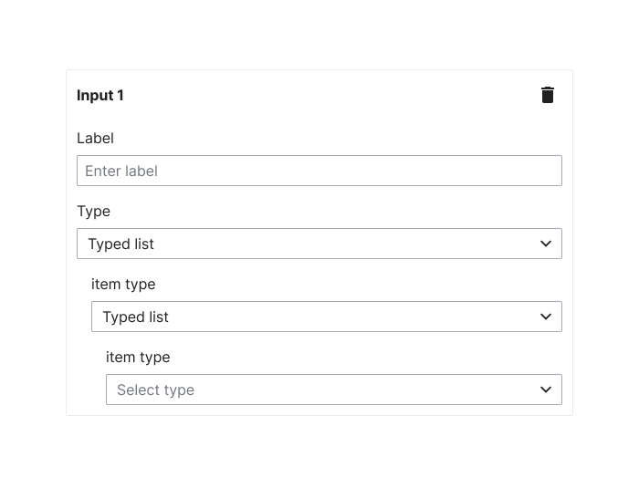

In the scenario where an input field emerges as a result of selecting an "other" option within a Checkbox or Radio list, the additional input field for including this "other" option should be positioned directly below the label of the "other" option selected. The input and the Checkbox or Radio label will be aligned.

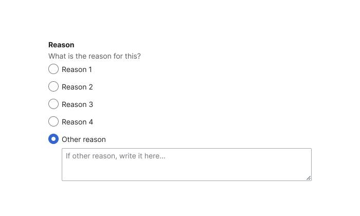

## Elements of a form

### Table of contents

A table of contents can be used with sections with the form in place of a multi-page or multi-step form. The table of contents itself should be aligned to the start side of the page, and should use links to navigate to the different sections on the page. A bottom border using the `border-color-base`, token should be used under the heading for each section within a form.

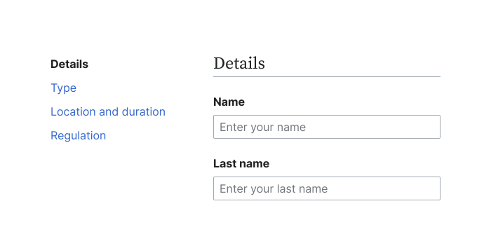

::: warning
Be cautious of using a table of contents on a form when there are other navigational elements in an adjacent sidebar on a page.
:::

### Footer

The footer of a form should be fixed to the bottom of the viewport, with a background and top border to separate itself from the form itself. This ensures that any related actions are in the same location at all times and are always accessible while scrolling. For forms that exist within a Dialog or smaller container, the actions should come directly after the last field.

A Primary Progressive Button should be the primary action in the footer of a form. Secondary, tertiary, and other actions may be Normal or Quiet Buttons, but should be Neutral in color, to not draw attention away from the primary action. If the form performs a destructive action, a Primary Destructive Button may be used in place of the Primary Progressive Button. Actions should be aligned to the start of the form with the most primary action positioned to the end within that group. Visit [using links and buttons](../style-guide/using-links-and-buttons.md#group-of-buttons) for more information on hierarchy and spacing.

When a form uses a table of contents, the footer should remain the width of the body of the form, or where the fields are, and not span to include the width of the table of contents.

If a disclaimer is needed, it should be included within the footer (fixed or not), directly above the submission action.

## Validation

Setting the status based on field validity is up to you. You can read more about the status prop on [Field](../components/demos/field.md) component.

<cdx-demo-rules>
<template #do-media>

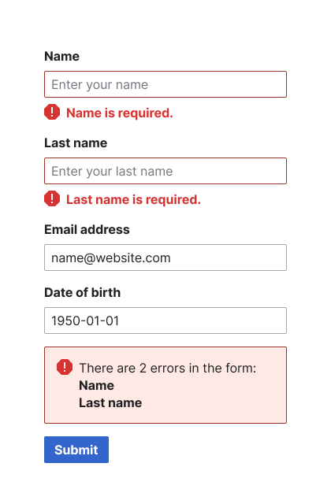

</template>
<template #do-text>

- Use inline validation or validation upon submission to alert a user of an error in the form.

</template>
<template #dont-media>

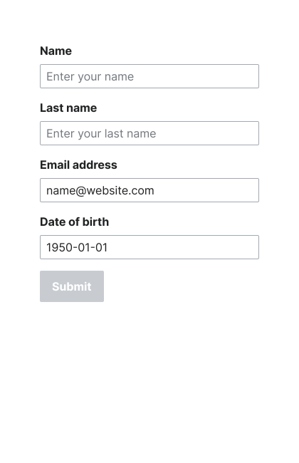

</template>
<template #dont-text>

- Use a Disabled Button to prevent users from submitting. Disabled Buttons should only be used on forms with only one field or input. Read more about Disabled Buttons on [Using links and buttons](../style-guide/using-links-and-buttons.md#group-of-buttons).
</template>
</cdx-demo-rules>

After an attempt to submit a form, if there are invalid fields, a message should appear above the submit button notifying the user of the errors. The contents of this message should be refreshed when the button is resubmitted. If there are no more errors, the message should disappear.

### Inline validation

Inline validation can be used to provide the user with immediate feedback when the option to do so is available and desired. An example of inline validation is providing a message that the provided value in a TextInput is not properly formatted. Note that inline validation requires JavaScript.

There are two stages at which inline validation can occur:
1. On blur (when the user leaves the field): Most of the time, inline validation should happen after the user has had a chance to complete the field, indicated by moving focus away from it. In the case of an error, when a user returns to a field to correct it, the error message and state should be removed once the input changes. If you cannot be sure that a user has completed a field until submission, validate on submit. Empty fields should be validated on submit.
2. On input (as the user is typing): In rare cases, it is worth interrupting the process of completing a field to provide feedback. Only validate on input when there are strict parameters that must be met, so informing the user of invalid input early will save them time and frustration. An example of this is when the input must start with a certain value or has a very limited length. Use this type of inline validation sparingly as receiving a premature error message can be distracting and annoying.

## Spacing

- Between a form and other elements on the page, including its own table of contents and footer, should use the `spacing-150` token (equivalent to `24px` in the default Codex theme).
- Between elements within a form (including section headings and fields from one another) should use the `spacing-100` token (equivalent to `16px` in the default Codex theme).
- Between sections within a form should use the `spacing-150` token (equivalent to `24px` in the default Codex theme).
- Between labels and their associated input or fieldset should use the `spacing-25` token (equivalent to `4px` in the default Codex theme) on desktop or `spacing-50` token (equivalent to `8px` in the default Codex theme) on mobile. This is built into the [Field](../components/demos/field.md) component.
- Modules with an entire form inside should have an interior padding between the edge of the module and any element within the module of `spacing-150` (equivalent to `24px` in the default Codex theme).
- Modules with fields inside should have an interior padding between the edge of the module and any element within the module of `spacing-75` (equivalent to `12px` in the default Codex theme).
- Between multi-column fields not within a module should use the `spacing-150` token (equivalent to `24px` in the default Codex theme).
- Between elements within a module grouping multiple fields and/or actions should use the `spacing-100` token (equivalent to `16px` in the default Codex theme).
- Between two or more options within a component (such as [Checkbox](../components/demos/checkbox.md) or [Radio](../components/demos/radio.md)) should use the `spacing-75` token (equivalent to `12px` in the default Codex theme). This is built into Checkbox and Radio.
- Between elements within a footer (such as the disclaimer and actions) should use the `spacing-100` token (equivalent to `16px` in the default Codex theme). For guidance on spacing between Buttons in a group, visit [Using links and buttons](../style-guide/using-links-and-buttons.md#group-of-buttons).
- Between actions in a footer should use the `spacing-75` token (equivalent to `12px` in the default Codex theme).

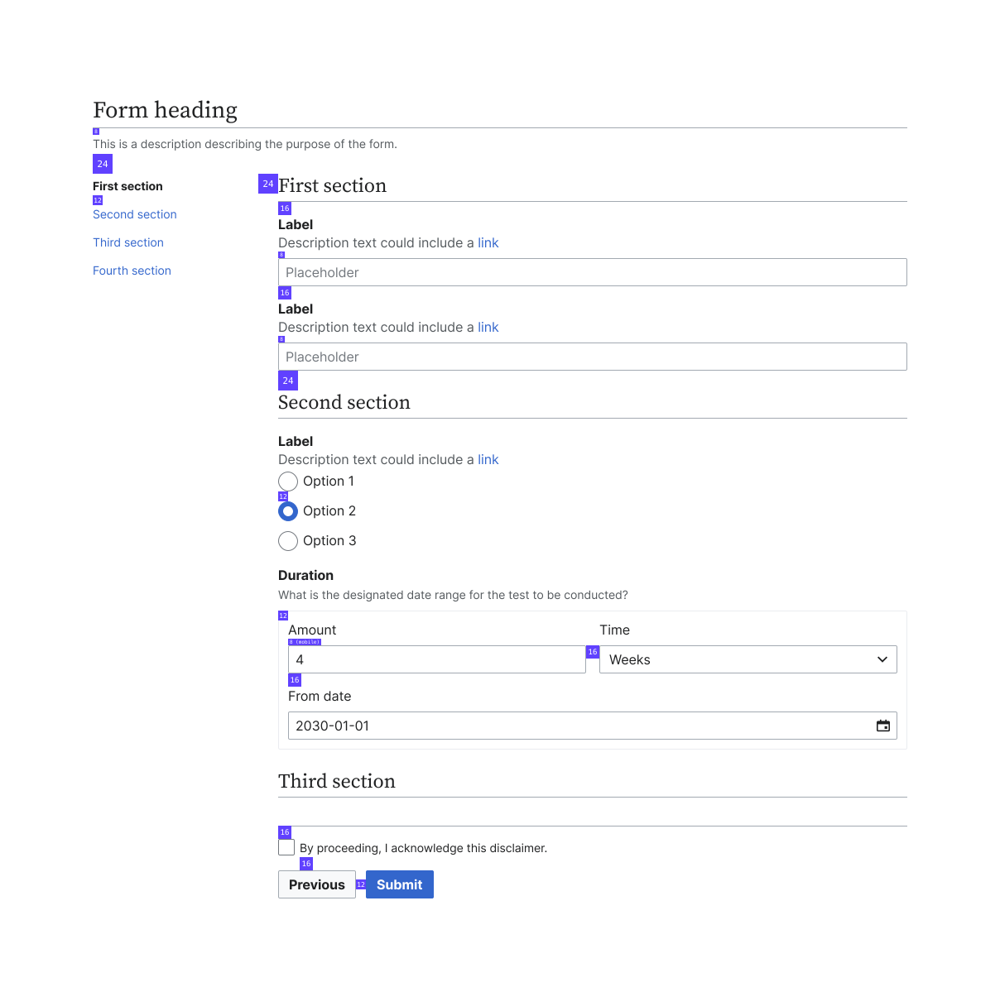

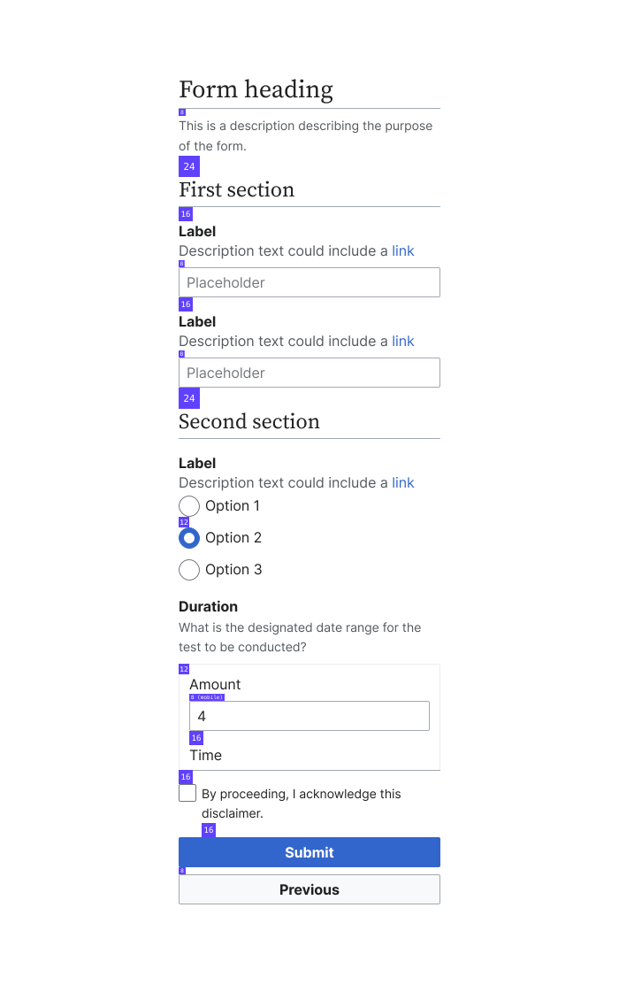

::: info
The spacing should remain the same at all breakpoints and screen sizes.
:::

## Responsive behavior

A form that uses multi-column fields should respond to a vertically stacked form starting at the `min-width-breakpoint-tablet` breakpoint (equivalent to `640px` in the default Codex theme). The fields and actions should span 100% of the width of the page or container. A table of contents should appear at the top of the form.

## Field type usage

[**Field**](../components/demos/field.md)

- Layout component that wraps an input or fieldset with features like a semantic label, description text, help text, and validation messages.

[**Fieldset**](../components/demos/field.md#fieldset-with-nested-fields)

- Variant of the Field component for a group of related inputs inside a `<fieldset>` element with an associated `<legend>`.

[**Label**](../components/demos/label.md)

- Semantic label for an input or fieldset. We recommend using the Field component, which outputs a Label, instead of directly using the Label component.

[**TextInput**](../components/demos/text-input.md)

- Short form text (inputType=’text’)
- Numbers (inputType=’number’)
- Email addresses (inputType=’email’)
- Passwords (inputType=’password’)
- Phone numbers (inputType=’tel’)
- URL (inputType=’url’)
- Time (inputType=’time’)
- For a full list of types, visit [TextInput](../components/demos/text-input.md).

[**TextArea**](../components/demos/text-area.md)

- Long form text.

[**ChipInput**](../components/demos/chip-input.md)

- Multiple custom inputted items.

[**Combobox**](../components/demos/combobox.md)

- Search for an option from a predetermined list.
- Select an option from a predetermined list.
- Short lists of options.

[**Lookup**](../components/demos/lookup.md)

- Search for an option from a predetermined list.
- Long lists of options.

[**Select**](../components/demos/select.md)

- Select an option from a predetermined list.
- Can be a short or long list of options.

[**Checkbox**](../components/demos/checkbox.md)

- Choose one or more options.
- Usually a list of less than 5 items.

[**Radio**](../components/demos/radio.md)

- Choose only one option.
- Usually a list of less than 5 items.

[**ToggleSwitch**](../components/demos/toggle-switch.md)

- Toggle between two binary options with an immediate response.
- A submit button is not being used.
- In places where a ToggleSwitch is desired but a submit button is present, a single Checkbox can be used to represent the binary option.
- Alternatively, if a ToggleSwitch must be used within a form that has a submit button, the description for the ToggleSwitch should explain that changes will not be instant, and instead will be made on submission of the entire form.

::: info
[TypeaheadSearch](../components/demos/typeahead-search.md) is not designed to be used inside of a form. Consider using [Lookup](../components/demos/lookup.md) or [SearchInput](../components/demos/search-input.md) instead.
:::

### Readonly and disabled inputs

TextInput and TextArea components are unique in that they have the properties of `disabled` *and* `readonly`. These states serve intentionally different purposes and should not be used interchangeably.

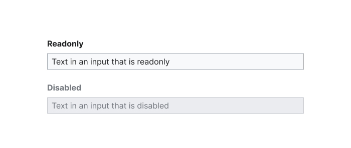

#### Readonly
The `readonly` state should be used when the content of an input should be seen and read, but not changed. The input receives focus, and the content may be copied but not edited. The value of a `readonly` input is logged with the submission of a form.

#### Disabled
The `disabled` state should be used when the content of an input does not need to be seen, read, or changed. Since disabled states do not require a 4.5:1 contrast ratio, content within a disabled input might not be seen by users with visual impairments. The input does not receive focus, and the content cannot be selected or copied. The value of a `disabled` input is *not* logged with the submission of a form.