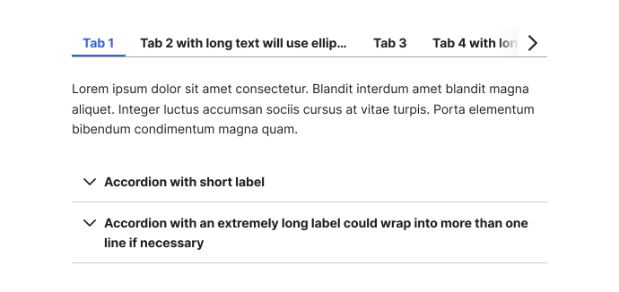
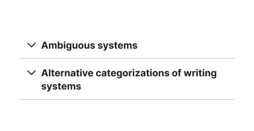
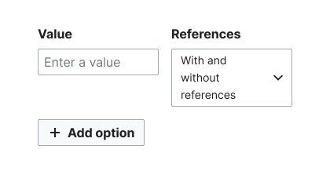
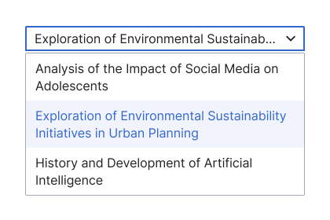
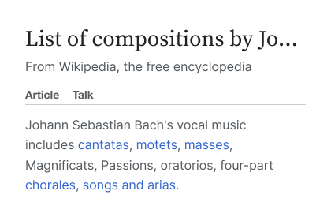
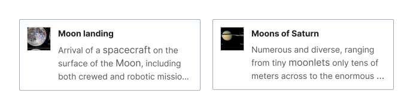
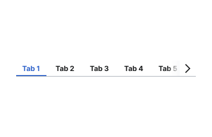
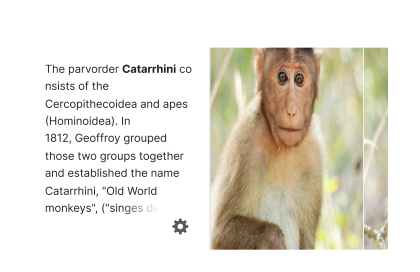

# Content overflow

An overarching guide for managing text and element content overflow in layouts.

## Types of content overflow

Content overflow occurs when the content within a component or element exceeds the designated space. This overflow can include:
1. **Text overflow:** When lengthy text exceeds the available space within a component, such as lengthy text within a button.
2. **Element overflow:** When all elements within a component are not visible due to space constraints, such as items requiring scrolling within a container.

To address the challenges posed by content overflow, we can use the following solutions:
- Wrap text or content onto multiple lines.
- Use an ellipsis to truncate overlong text.
- Implement a fade effect to indicate that content can be scrolled to reveal additional information.

## Wrapping

Content wrapping involves allowing text or elements to overflow onto multiple lines. It is suitable for components where the height is not fixed or where vertical expansion is acceptable.

<cdx-demo-rules>

<template #do-media>

</template>

<template #do-text>

- Use wrapping as the base solution to content overflow, enabling text to extend onto multiple lines when it doesn’t affect the fixed height of the component.

</template>

<template #dont-media>

</template>

<template #dont-text>

- Use wrapping in elements where uniformity in height is crucial.

</template>

</cdx-demo-rules>

## Truncation with ellipses

Ellipses truncation can condense text in cases where the text becomes longer than expected.

<cdx-demo-rules>

<template #do-media>

</template>

<template #do-text>

- Use an ellipsis to maintain consistency when component height is essential.
- Use an ellipsis to prevent disparities in the heights of element groups, such as a collection of chips or a group of buttons.
- Include tooltip support for truncated text, enabling users to access full content as needed.

</template>

<template #dont-media>

</template>

<template #dont-text>

- Use an ellipsis in elements where uniformity in height is not crucial.

</template>

</cdx-demo-rules>

### Optional ellipses truncation

Ellipses truncation can also be used to optionally customize the number of lines for lengthy descriptions in specific components, like [Card](../components/demos/card.md) or [Menu](../components/demos/menu.md). In such cases, tooltips are unnecessary for displaying the entire description, as they are primarily used to display the label's content.

### Bidirectionality for ellipses truncation

In left-to-right (LTR) languages, the ellipsis typically appears on the right side of the truncated text. In right-to-left (RTL) languages, such as Arabic or Hebrew, the ellipsis is typically situated on the left side, aligning with the natural flow of reading.

Refer to the [Bidirectionality guidelines](./bidirectionality.md) for more information about handling LTR and RTL behaviors.

    
    

## Truncation with fade

Fade effects can be used as visual indicators of scroll within a group of elements, and they should not be used to indicate text truncation.

<cdx-demo-rules>

<template #do-media>

</template>

<template #do-text>

- Reserve fade effects to indicate that a group of elements can be scrolled.

</template>

<template #dont-media>

</template>

<template #dont-text>

- Use fade effects for truncating text. Instead, use an ellipsis for text truncation.

</template>

</cdx-demo-rules>