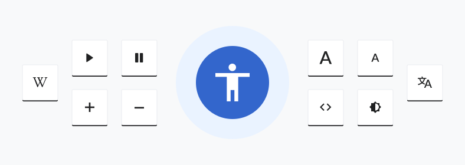

# Overview

When making design decisions, we need to choose among possible solutions. Design principles help to
decide what to prioritize.

Our design principles:
- [This is for everyone](#this-is-for-everyone)
- [Content first](#content-first)
- [Open to collaboration](#open-to-collaboration)
- [Trustworthy yet joyful](#trustworthy-yet-joyful)
- [Design for consistency](#design-for-consistency)

These are described below and aligned to our statement of purpose. Find further [details at Design on Wikimedia Meta-Wiki](https://meta.wikimedia.org/wiki/Design).

## This is for everyone

We aim to support a very diverse audience. This is a core part of our mission. We strive to help
users overcome any barriers that may exist between them and the knowledge our projects provide.
These barriers could include accessibility, languages, device and network capabilities, levels of
technical expertise, or many other circumstances. When improving the experience for a given group
of people, we need to make sure we are not increasing the barriers for others.

## Content first

People come to Wikimedia projects for their content. Our solutions should help to facilitate its
creation, consumption, and sharing — without getting in the way. Our content (facts, images,
quotes, etc.) is our most representative element and needs to be emphasized in our solutions.

## Open to collaboration

Our projects are collaborative. Discussion and sharing are key factors to consider. To support diversity and a global mission, our solutions need to provide room for extension and customization
to meet particular needs and foster different perspectives.

<figure>
	
	<figcaption>Group photo during Wikimania 2016 in Ensino Lario with volunteers attending from all around the world.</figcaption>
</figure>

## Trustworthy yet joyful

Wikimedia projects provide reliable educational knowledge. At the same time, our projects are a
source of entertainment and satisfy human curiosity. This requires us to find the right balance: we
need to convey trust with our solutions and remain entertaining and fresh.

## Design for consistency

It is important to rely on familiar concepts to facilitate understanding. People relate quickly and
orient easily when we keep consistency in our design and maintain common patterns – independent
while careful of their platforms, languages or form factors.

<figure>
	
	<figcaption>Screenshots of Galaxy Wikipedia article in Egyptian Arabic on Android, <a href="https://en.m.wikipedia.org/wiki/Galaxy">English on mobile web</a> and Japanese on iOS.</figcaption>
</figure>
