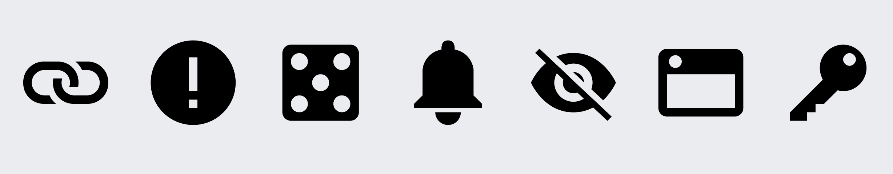
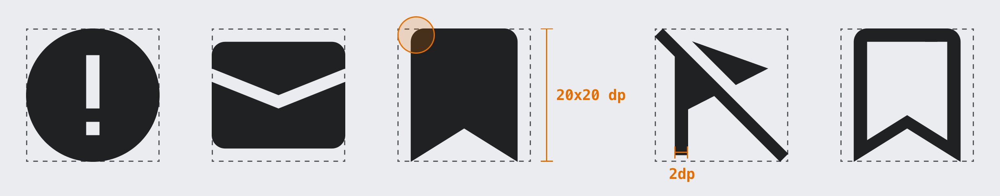
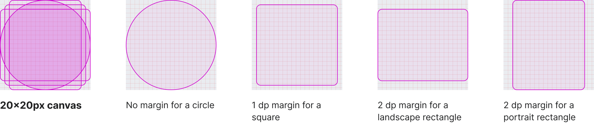

# Icons

Icons help convey a message visually.

## Principles

Wikimedia icons should be simple and neutral.[[1]](#ref1)

### Reduce to the essential form

Use fewer details to convey the icon in as simple a shape as possible. The core idea of the design
should be clearly conveyed and should remain discernible even at smaller sizes. For example, a
keyboard should not be represented by showing all 100+ keys that are in the real object, since this
would make it unrecognizable.

### Universal rather than culturally-specific

Symbols and ideas represented in iconography should be known to a global audience. For example, do
not use a dollar sign “$” to represent money, or a four-leaf clover to represent luck.

### Avoid textual content within the icon

Besides loss of universal recognition when including a specific language element, it may add
unnecessary complexity. There are exceptions for icons related to language/text (for example, the
icon for language switching).

### Abstract forms or concrete objects

Take consideration when deciding to use abstract or concrete objects when designing an icon. In
some cases, concrete objects are preferred, such as using dice to convey “random” or a bell to
convey an alert. In other cases, abstract symbols may be preferable, such as using an question mark
“?” for help rather than a life preserver, or an ellipsis “…” to indicate “more”.

### Neutral point of view

Avoid concepts such as gestures, animals, religion, humor, ethnicity, and gender.

## Usage

### Icon size

Icons can be used inside other components, like buttons. Icons support a few different pre-defined
size options. Right now the supported sizes are: 20px, 16px or 12px. If no size property is
provided, 20px size will be used by default.

### Adapt and remix

Our icons are freely licensed under [Creative Commons Attribution 4.0 (CC BY 4.0)](https://creativecommons.org/licenses/by/4.0/).
The simple style and guidelines make it easy to reuse or adapt existing freely licensed icons that
you can find on other repos such as [Material icons](https://material.io/guidelines/style/icons.html)[[3]](#ref3)
or the [Noun project](https://thenounproject.zendesk.com/hc/en-us/articles/200509798-What-licenses-do-you-use-)[[4]](#ref4).
You are welcome to use existing icons that align to the proposed style instead of reinventing the
wheel icon.

## Visual style

Characteristics of a Codex icon:
- **Monochromatic**. Solid color icons.
- **Geometric**. Comprises simple and symmetrical geometric shapes. Symmetrical icons tend to be
  more universally applicable. For example, an open book would be preferred to a closed book with
  binding on the left or right side).
- **Front-facing**. Icons are flat and front facing, not multi-dimensional.
- **20 x 20 dp default canvas**. WikimediaUI icons are put on a 20 x 20 device-independent pixel
  (dp) canvas per default.[[2]](#ref2)
- **Rounded corners**. Corners are rounded to make shapes friendly and welcoming. For the default
  canvas use 2 dp rounded corners. Note that rounded corners are applied only on the exterior of an
  icon shape, not interior corners.
- **Medium thick stroke**. Lines and outline should be visible at smaller sizes without effort, for
  the default icon canvas use a 2 dp thick stroke as standard. Endpoints of lines are square in
  keeping with simple geometric shapes.
- **Diagonal cross-out lines**. For icons that appear to be crossed-out, the cross-out line starts
  from the top-left of the icon and continues at a 45 degree angle to the bottom right (similar to
  a backslash “\”).

## Creating icons

The default canvas is 20 x 20 dp. In order to allow for optical adjustments, a different margin is
applied depending on the shape of the icon.

Different shapes have different perceived sizes. A 1 dp margin for a square-shaped icon is used. A
circle uses the full 20 x 20 dp canvas available to reach a similar perceived size.

**Black icons:** Use black colored icons on a transparent background, as the boldest representation
of an icon. The color can be changed when the icon is used (preferably done automatically by
software).

**Filled areas with no stroke outlines:** For example, a donut icon is a filled circle with a hole
in the middle, as opposed to an unfilled circle with a thick stroke outline.

**Pixel-fitting:** Ensure icon shape edges are fit to pixels as closely as possible, so that shapes
are not distorted or fuzzy.

**Right-to-left (RTL) and left-to-right (LTR) considerations:** In cases where the icon is
non-symmetrical, consider whether RTL or LTR directionality changes the meaning conveyed before
creating the alternate direction variation. For example, the play button is universally seen as a
triangle with a straight left edge and does not require two variations, whilst a bullet list icon
would show the “bullets” in the list on the right or left side depending on whether it is shown in
RTL or LTR language context.

## Resources

Find all currently available icons in the [Assets library](https://www.figma.com/file/1lT9LKOK6wiHLnpraMjP3E/%E2%9D%96-Assets-(Icons%2C-Logos%2C-Illustrations)?node-id=3295-13631&t=XsJ03mZaUOTNMw9j-0) in Figma.

We provide a listing of all icons with their ids for implementation in the [Codex demo](../icons/all-icons).

Additionally you also find all icons as single, [SVGO production optimized](https://www.mediawiki.org/wiki/Manual:Coding_conventions/SVG)
SVGs for usage outside of MediaWiki.

## References

1. Thanks to volunteer contributor [@SamanthaNguyen](https://phabricator.wikimedia.org/p/SamanthaNguyen/) for many suggestions on the “Principles” section in icons on [Phabricator task T155684](https://phabricator.wikimedia.org/T155684).
2. 1 dp equals 1 px in CSS at 100% zoom level and 1x device. [Device-independent pixel on English Wikipedia](https://en.wikipedia.org/wiki/Device-independent_pixel).
3. Google offers a [Material icons overview and guide to use](https://material.io/guidelines/style/icons.html).
4. The Noun Project provides curated [icon sets](https://thenounproject.zendesk.com/hc/en-us/articles/200509798-What-licenses-do-you-use-) that are either Creative Commons Attribution (CC BY) or Public Domain (PD)
