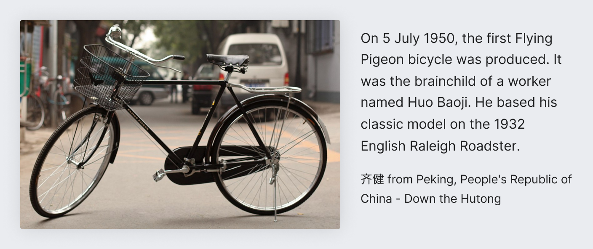

# Images

Images are found in Wikimedia projects as standalone contributions and as supplementary content to
engage and communicate with individuals.

## Image selection

We use images to help increase understanding and engagement with individuals. When using images in
our projects, the selections follow general guidelines:
- **Contextually relevant.** Images relate directly to the subject of the article. An article about
  bicycles should contain images that relate to, support, and enrich content about bicycles.
- **Neutral point of view.** When showing an image of a shark, consider a side profile photograph
  of a shark instead of an action shot of a shark preying on another animal.
- **Representation in the most accurate medium.** Use a photograph of Rosalind Franklin in her
  biographic profile, rather than an artistic drawing. In an article about Donald Duck, use a
  cartoon still of Donald Duck instead of a photograph of a duck.
- **Good resolution quality.** Images should be high quality.
- **Respects copyright.** Images should be correctly attributed. Use Creative Commons, Fair use, or
  Public Domain images stored on Wikimedia Commons, and other sources that comply correctly with
  copyright licensing.

## Resources

For project-specific details, see the [Image use policy](https://www.wikidata.org/wiki/Q6618850)
pages (e.g. for [English Wikipedia](https://en.wikipedia.org/wiki/Wikipedia:Image_use_policy)), and
[Manual of Style/Images](https://www.wikidata.org/wiki/Q16745099) guideline pages (e.g. for
[English Wikipedia](https://en.wikipedia.org/wiki/Wikipedia:Manual_of_Style/Images)), that exist at
some projects.
