# Using links and buttons

An overarching guide for when to use links, buttons, and groups of both.

## Links versus buttons

Use a [Link](../components/mixins/link.md) when navigating to a different resource or section on the same page, and use a [Button](../components/demos/button.md) to perform an action.

Making the difference between Links and Buttons is important to help inform the user of an expected interaction, especially for keyboard and screen reader users.

::: tip Accessibility note
Links can be activated using only the <kbd>Enter</kbd> or <kbd>Return</kbd> key, while Buttons can be activated using both the <kbd>Enter</kbd> or <kbd>Return</kbd> key as well as the <kbd>Space</kbd> key.
:::

**A Button should not be styled as a Link and a Link should not be styled as a Button.**
- Avoid styling an anchor tag `<a>` as a button and instead use a Codex [Button](../components/demos/button.md).
- Avoid styling a button tag `<button>` as a link and instead use a Codex [Link](../components/mixins/link.md).

<cdx-demo-rules>
<template #do-media>

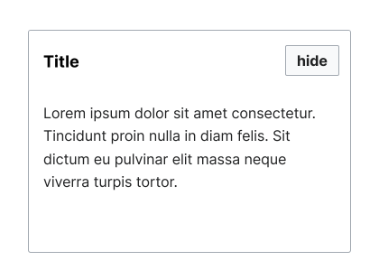

</template>
<template #do-text>

- Use Buttons where the element performs an action on the same page.

</template>
<template #dont-media>

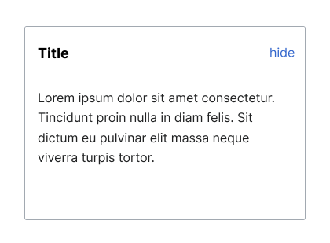

</template>
<template #dont-text>

- Use Links disguised as Buttons or where the element does not navigate to another page or section.

</template>
</cdx-demo-rules>

::: info
There are, however, exceptions to this guidance, where the visual style is absolutely necessary to emphasize a link. In such cases, such as “Donate” or “Register” actions which link to another page, [use these guidelines](../components/demos/button.md#link-buttons-and-other-elements) to implement a Link which visually appears as a Button, but is semantically a different type of element.
:::

## Group of links and buttons

Links and Buttons can be used in the same group next to one another.

**Be conscious of the fact that Quiet Progressive Buttons can look similar to Links, so avoid using them next to each other.**

### Spacing

A Button next to a Link should have `@spacing-75` (equivalent to 12px in the default Codex theme) as the default [spacing token](../design-tokens/spacing.md). Links next to Links should also have `@spacing-75` as the default spacing token. Buttons next to Buttons should have `@spacing-50` (equivalent to 8px in the default Codex theme) as the default spacing token.

## Links

Use Link to provide users with a clickable element to navigate to other pages or to other sections of the same page (such as citations and other wiki pages).

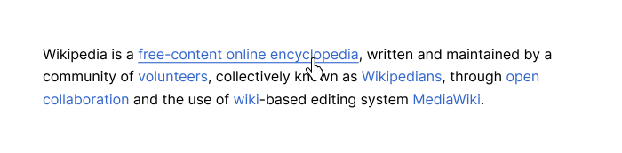

Avoid using Link to perform an action (such as “hide” or "edit" when using VisualEditor). In the case of an action that appears as a button, but loads a different page, a link should still be used (such as “edit” when *not* using VisualEditor).

**Links are not underlined by default.**
- By default, links are only underlined when they are hovered over or pressed.
- In MediaWiki, to suit user preferences and for accessibility reasons, having links underlined by default can be enabled within Preferences > Appearance > Advanced options.

**Links are used as text only.**
- An exception to this is a Link that opens in a new tab or window. These external links must use the external link icon, `cdxIconLinkExternal`, in addition to the text to denote a destination outside of the current domain.
- Links should not be icons alone.

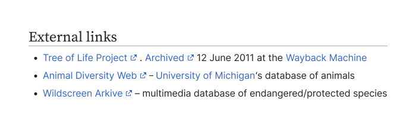

### Standard Link

Use Standard Links (blue) as the default Link type.

### Red Link

Use Red Links only to represent wiki pages that do not exist yet.

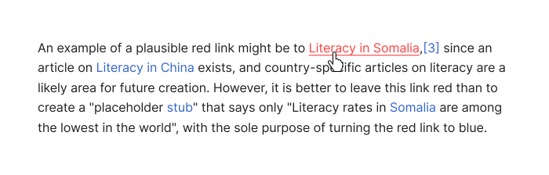

### Link Font Styling

- Any of the Codex font size tokens can be used.
- Fonts should remain the size of the surrounding text when a part of other content.
- Use the Regular weight by default for Links.
- Links may be Bold or Italic when a part of surrounding text where that text is also Bold or Italic or when they need to be emphasized apart from default Links.

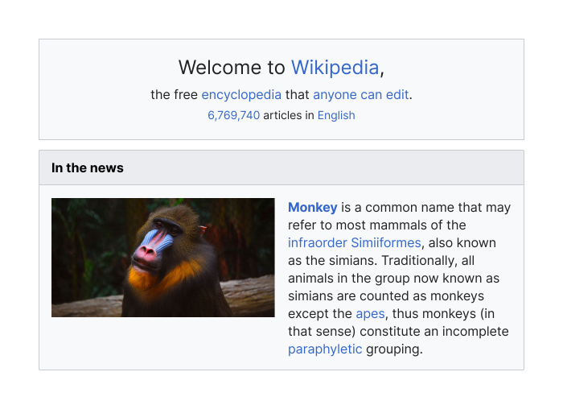

## Group of links

When Link content is related, it's advisable to combine them into a group. A group of Links can include any number of Links.

### Spacing

Use `@spacing-75` as the default spacing token between Links in a group, both horizontal and vertical (stacked).

Group of multiple links can be presented in various ways:

1. As a single vertical column, such as the Table of Contents on an article page.

2. When there are too many links, they can be organized into different columns, such as the link groups within the languages panel on [wikipedia.org](https://www.wikipedia.org/).

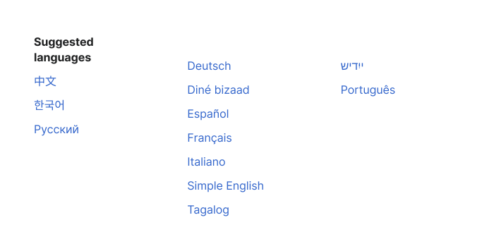

3. As a horizontal line, such as the footer links on an article page.

## Buttons

### Action or variant (“flavor”)

1. **Neutral**

<cdx-demo-rules>
<template #do-media>

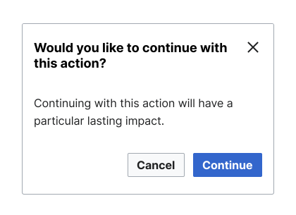

</template>
<template #do-text>

- Use Neutral Buttons for actions that are of secondary level of importance (such as “Cancel” or “hide”).

</template>
<template #dont-media>

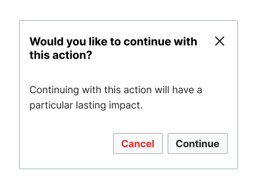

</template>
<template #dont-text>

- Use Neutral Buttons for actions that are of primary level of importance (such as “Continue” or “Save”).

</template>
</cdx-demo-rules>

2. **Progressive**

<cdx-demo-rules>
<template #do-media>

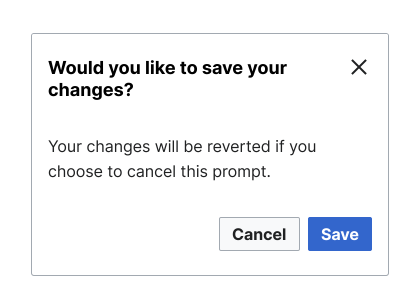

</template>
<template #do-text>

- Use Progressive Buttons for actions that lead to the next step in the process (such as “Save” or “Continue”).

</template>
<template #dont-media>

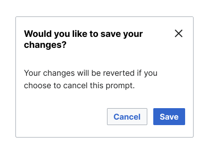

</template>
<template #dont-text>

- Use Progressive Buttons for actions that don't move a process forward (such as "Cancel" or “Previous”).

</template>
</cdx-demo-rules>

3. **Destructive**

<cdx-demo-rules>
<template #do-media>

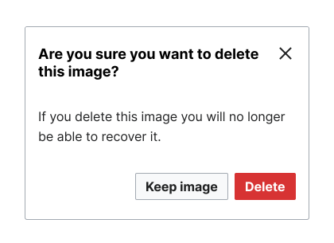

</template>
<template #do-text>

- Use Destructive Buttons for actions that involve removal or limitation (such as “Delete” or “Block”.

</template>
<template #dont-media>

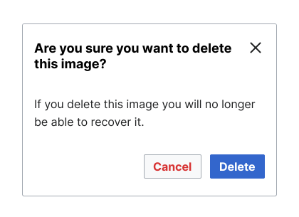

</template>
<template #dont-text>

- Use Destructive Buttons for safe actions such as "Cancel".

</template>
</cdx-demo-rules>

### Weight

<figure>
  

	  
  

	<figcaption>From left to right: Normal Button, Primary Button, Quiet Button</figcaption>
</figure>

1. **Primary** Use a Primary Button to signal the main or most important action in a given view (such as a page or dialog). Use only one Primary Button per view.

::: info
Primary buttons are implemented only for Progressive and Destructive flavors. Neutral buttons do not have this weight available.
:::

2. **Normal** Use Normal Buttons as the default or secondary actions.

3. **Quiet** Use Quiet Buttons for an easily recognizable action that does not detract focus from the content. Be conscious of the fact that Quiet Progressive Buttons can look similar to Links, so avoid using them next to each other.

::: tip
Use Quiet Buttons to emphasize Normal Buttons when both are combined on the same page.
:::

#### Button with Icon

- Use an icon to visually reinforce the text of the Button, conveying meaning both textually and visually.
- Try incorporating icons only when they are universally recognizable and provide meaningful reinforcement, reducing the user's cognitive effort for comprehension.

#### Icon-only Button

- Use Icon-only Button where space is limited.
- Use only when the action (icon) can be universally recognized, such as “edit” or “search”.
- In case the icon used might not be universally understood, use a label to make it accessible. [Read](../icons/overview.html#icon-labels) about writing accessible labels for icons.

#### Disabled Button

<cdx-demo-rules>
<template #do-media>

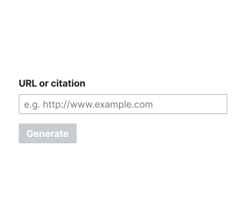

</template>
<template #do-text>

- Use only when one input or interaction will enable the Button (such as generating a citation).

</template>
<template #dont-media>

</template>
<template #dont-text>

- Use Disabled Buttons at the end of a form with multiple fields where all required fields have yet to be completed.  Instead, use inline validation on the attempt to submit the form, guiding the user to what needs to be completed in order to successfully submit the form.

</template>
</cdx-demo-rules>

## Group of buttons

A group of Buttons usually includes 2 to 3 Buttons. When more actions are needed in a group of Buttons, use an Icon-only Button with the ellipsis icon `cdxIconEllipsis` to trigger a menu with any additional actions.

Buttons should be combined in a group when they relate to the same affected general element, such as footer actions within a Dialog and actions at the end of a form or the top of a Table.

When actions are direct siblings of one another, affecting a more focused element, a [ButtonGroup](../components/demos/button-group.md) should be used. An example of this is a set of actions to “Download”, “Edit”, or “Delete” the same element.

### Spacing

Use `@spacing-50` as the default spacing token between Buttons in a group, both horizontal and vertical (stacked). This spacing guidance does not pertain to [ButtonGroup](../components/demos/button-group.md) or [ToggleButtonGroup](../components/demos/toggle-button-group.md).

### Types and Order of Buttons

Using the right action, weight, and order of Buttons is important to help users understand the different actions they can take.

#### Hierarchy

- The primary action should be represented by a Primary Progressive Button. Use only one Primary Progressive Button in a group of Buttons.
- Secondary actions can accompany the Primary Progressive Button as normal Buttons.
- Tertiary, less important actions should appear as Quiet Buttons.
- A group of Buttons can include any combination of these levels. For example, for a group with a primary action and a less important tertiary action, use a Primary Progressive Button and a Quiet Button. A group with no primary action will only have Normal and Quiet Buttons.

#### Order

- When stacking buttons is necessary (most commonly on smaller viewports), the most important Button should appear on top.
- The order of a stacked group of Buttons does not change between left-to-right (LTR) and right-to-left (RTL) reading directions.
- Do not place a Destructive Button next to a Progressive Button. If these are the only two Buttons in a group, consider placing them on opposing sides of the container, or consider using a Neutral Normal Button for one of the actions.

::: info
The order of a stacking group of Buttons does not change with bidirectionality.
:::

### Forward moving processes (forms, Dialogs, etc.)

- A non-stacking group of Buttons should have the most important Button at the start; or at the end if part of a flow.
- Buttons in the footer of a form, whether single step or multi-step should be aligned to the leftmost edge of the overall container for LTR and the rightmost edge of the overall container for RTL.
- Buttons in the footer of a Dialog, whether single step or multi-step should be aligned to the rightmost edge of the overall container for LTR and the leftmost edge of the overall container for RTL.

#### Multi-step

For multi-step processes, align a back Button next to the forward Button. The back Button should be of less visual hierarchy than the forward Button. Usually it comes second in the hierarchy. For example, “Next” is set as a Progressive Primary Button on the right for LTR or the left for RTL, next to that would be “Previous” set as a Neutral Normal Button, and next to that might be a tertiary action set as a Neutral Quiet Button (such as “Skip”).

