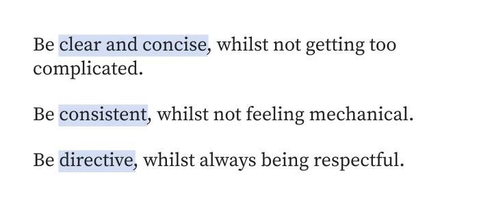
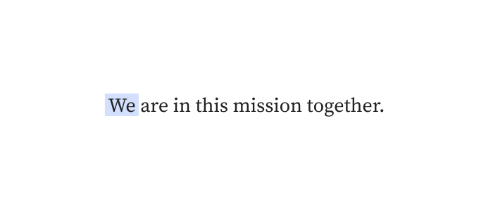
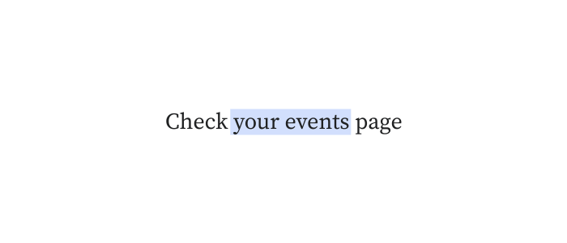
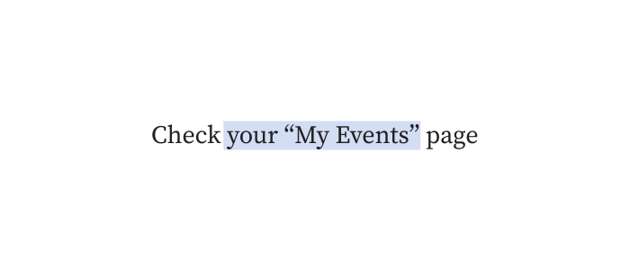
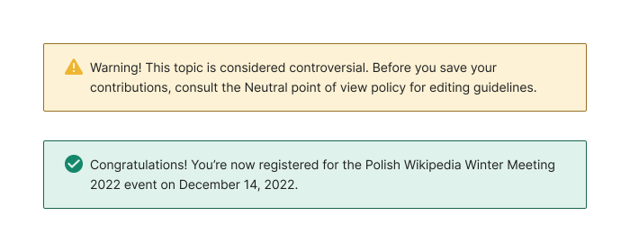

# Voice and tone

Content is more effective when it doesn't distract the reader/editor from their task and allows them to make decisions quickly, easily, and confidently whilst navigating the user interface.

## Voice

Voice is the consistent language and terminology that makes an experience distinct from others. It expresses the brand's personality and values. You can recognize the voice in things like word choices, how sentences are constructed, punctuation and how titles or subtitles are used.

### Our voice reflects who we are

We are the voice of free knowledge, empowering and engaging people around the world to collect and develop educational content, and make it accessible to everyone.

This means our voice as a platform must keep the user focused on the task they are doing.

### Our point of view is neutral

We are focused entirely on empowering our users to create, edit, and read content. For this reason, we avoid sharing personal opinions in how we talk to our users.

### Consider *who* is speaking, and to *whom*

#### First person ####
It refers to the speaker *(I, we)*. Generally, avoid using the first person voice, except when it is clearly referring to the Foundation or other Wikimedia-related entities, such as in the following example of one of [Wikimedia's values](https://wikimediafoundation.org/about/values/).

#### Second person ####
It refers to the person who is being spoken to *(you)*. For features, use “Your” instead of “My”. Using “My” in the UI can end up forcing words into quotes. “Me/my” is reserved for when the user is communicating with Wikimedia.

<cdx-demo-rules>
<template #do-media>

</template>
<template #do-text>

- Use second person when instructing the user to perform an action

</template>
<template #dont-media>

</template>
<template #dont-text>

- Use first person to describe user ownership

</template>
</cdx-demo-rules>

#### Third person ####
It refers to the person who is being spoken about *(he, she, they, it)*. With an active voice the subject of the sentence receives the action. Use the third person in an active voice for content and most UI copy.

## Tone

The tone of the Wikimedia voice will shift to reflect the task you are writing for. For example, always use a neutral voice for the copy in a warning message which should be plain and clear, whilst the copy should be celebratory and informative when the user has succeeded at their task.

