# Apps

    <figure class="cdx-docs-figure">
        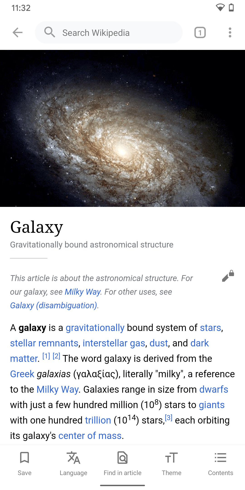
        <figcaption class="cdx-docs-figcaption">Wikipedia app on Android</figcaption>
    </figure>
    <figure class="cdx-docs-figure">
        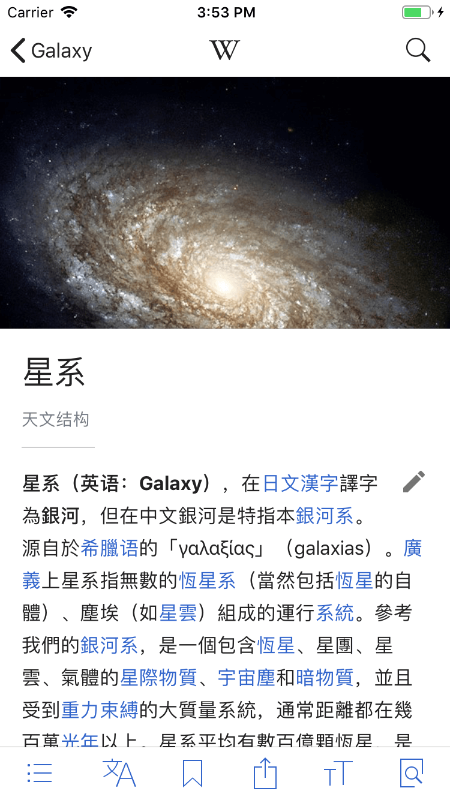
        <figcaption class="cdx-docs-figcaption">Wikipedia app on iOS</figcaption>
    </figure>
    <figure class="cdx-docs-figure">
        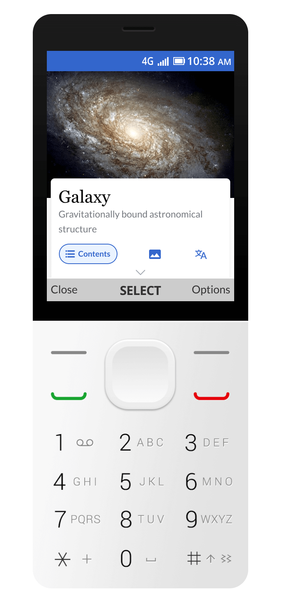
        <figcaption class="cdx-docs-figcaption">Wikipedia app on KaiOS</figcaption>
    </figure>

Designing for mobile apps presents unique challenges and opportunities compared to traditional
websites. Mobile apps run natively on devices, accessing system resources that web-based
architectures find more challenging to utilize. Key characteristics of apps are:
- Apps are designed to fit with the rest of the operating system. When an app fits in with the rest
of the OS, it looks and feels more at home, and it lowers the user’s learning curve.
- A deep integration with the OS comes with benefits right out of the box, e.g. accessibility,
performance, integration with voice assistants or
[home screen widgets](https://design.wikimedia.org/blog/2021/04/26/bringing-wikipedia-to-the-homescreen-on-ios.html).
- Offline capabilities and often reduced data usage: offline capabilities allow users to consume
content from anywhere, even when they are not connected to the internet or have low connectivity.

Wikimedia Foundation's apps are essential to meet our
[“This is for everyone” design principle](./design-principles-overview.html#this-is-for-everyone).
Wikipedia apps are designed with the philosophy of mobile first in mind. One of the core principles
of [mobile first](https://mobile-first.abookapart.com/) is to embrace the constraints of a mobile
environment and, with it, prioritize essential information, as there’s not enough room for
everything.

Limited connectivity of people in certain areas of the world inspires us to create products that are
performant and light on data. When building new features for people using mobile apps, we strive for
excellence in user experience and aim to break down complex existing flows and processes.

## Strategy

**The apps are here to create mobile first experiences** and are not trying to replace existing
desktop or community tools. Through the apps, we aim to meet potential users where they are. We are
interested in understanding and addressing the barriers of those historically left behind while not
compromising the integrity of the workflows of our long-time users on other platforms. Ensuring
participation naturally fits into the mobile-first lives we lead.

**The apps are a place to experiment.** Due to the development speed, richer capabilities, and the
unique needs of our user base, we can experiment. It is on the apps where we think the future of
mobile editing will be discovered. Notably, the apps are where we piloted
[micro contributions](https://www.mediawiki.org/wiki/Wikimedia_Apps/Suggested_edits#Welcome_to_Suggested_edits),
our most successful editing intervention to this date.

**The apps are a forcing function to make our technologies future proof.** To provide an example:
Right now, Wikipedia’s web experience only works as a website and cannot be exported to new mediums.
By building on the apps, we create technology that is platform independent and enables next
generation experiences, whether these use artificial intelligence, augmented reality, or future
technology that is changing our world.

## Theming

As mentioned in the introduction, iOS and Android both have platform specific guidelines. When
building apps for the global Wikimedia movement, we aim to create native experiences for the
specific platform. When designing for mobile apps, guidelines for the platform sit at the top of the
hierarchy. Throughout Wikimedia's product suite, we follow the
[visual design principles](./overview.html) when providing solutions.

To create a seamless and familiar experience within Wikimedia’s products and services, we apply
theming that is based on the visual style guidelines. Theming allows us to customize the app’s look
and feel to better represent our product’s brand. Theming is reflected in the UI, including
individual components, like buttons. Here’s an example of applying Material Theming in the Wikipedia
Android app:

    <figure class="cdx-docs-figure">
        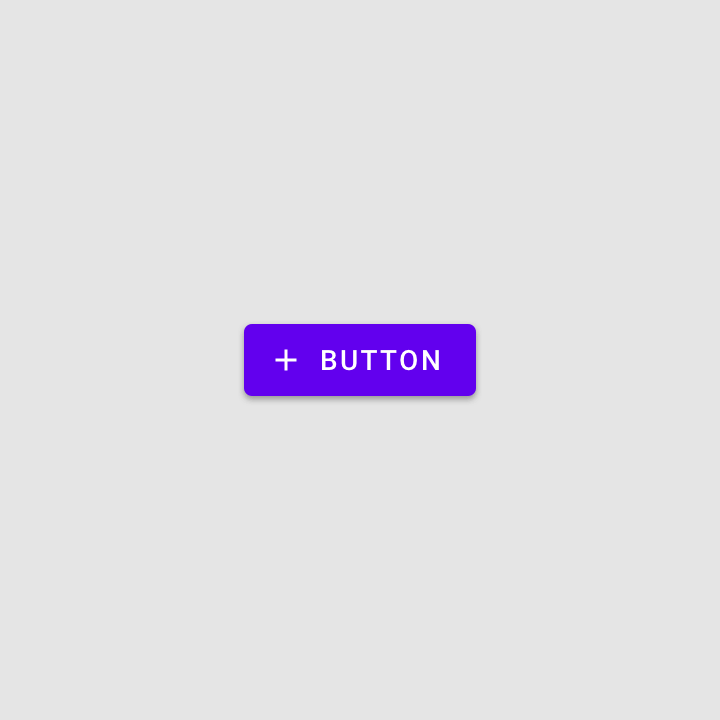
        <figcaption class="cdx-docs-figcaption">
            A standard Material button
            <a href="https://material.io/design/material-theming/overview.html#material-theming">
                (image source)
            </a>
        </figcaption>
    </figure>
    <figure class="cdx-docs-figure">
        
        <figcaption class="cdx-docs-figcaption">
            A themed button in the Wikipedia for Android app
        </figcaption>
    </figure>
    <figure class="cdx-docs-figure">
        
        <figcaption class="cdx-docs-figcaption">
            Chat toolbar in iOS messaging
            <a href="https://developer.apple.com/design/resources/">
                (image source)
            </a>
        </figcaption>
    </figure>
    <figure class="cdx-docs-figure">
        
        <figcaption class="cdx-docs-figcaption">
            Editing toolbar in the Wikipedia for iOS app
        </figcaption>
    </figure>
    <figure class="cdx-docs-figure">
        
        <figcaption class="cdx-docs-figcaption">
            KaiOS standard progress indicator
        </figcaption>
    </figure>
    <figure class="cdx-docs-figure">
        
        <figcaption class="cdx-docs-figcaption">
            We used a planet animation progress indicator to show the vast amount of knowledge
            available on Wikipedia.
        </figcaption>
    </figure>

The apps utilize the color palette defined in the Codex design system. Since both the Android and
iOS Wikipedia apps are available in four different reading themes (Light, Sepia, Dark, and Black),
they use an enhanced color palette for an optimal reading experience.

    <figure class="cdx-docs-figure">
        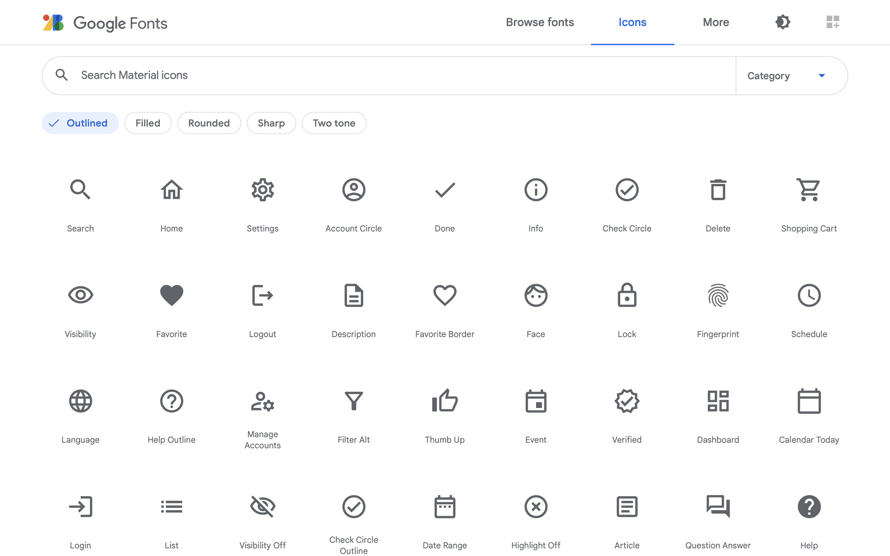
        <figcaption class="cdx-docs-figcaption">
            The Wikipedia Android app uses Material Icons
        </figcaption>
    </figure>
    <figure class="cdx-docs-figure">
        
        <figcaption class="cdx-docs-figcaption">
            The Wikipedia iOS app uses SF Symbols
        </figcaption>
    </figure>

As defined in [typography](./typography.html), the apps rely on the operating system's default
sans-serif typeface. The apps mostly use icons the platform provides, e.g. from Google Material or
Apple Human Interface Guidelines, except for icons associated with established Wikimedia products or
services (e.g. Wikipedia’s icon for user talk pages).

## Principles

### Focus

    <figure class="cdx-docs-figure">
        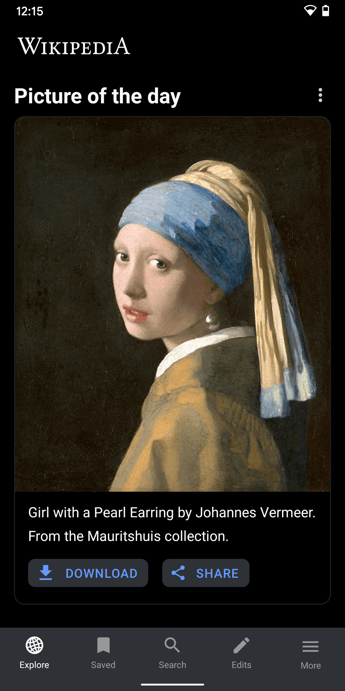
        <figcaption class="cdx-docs-figcaption">
            The “Picture of the day” on Wikipedia for Android puts content from Wikimedia Commons in
            the spotlight.
        </figcaption>
    </figure>
    <figure class="cdx-docs-figure">
        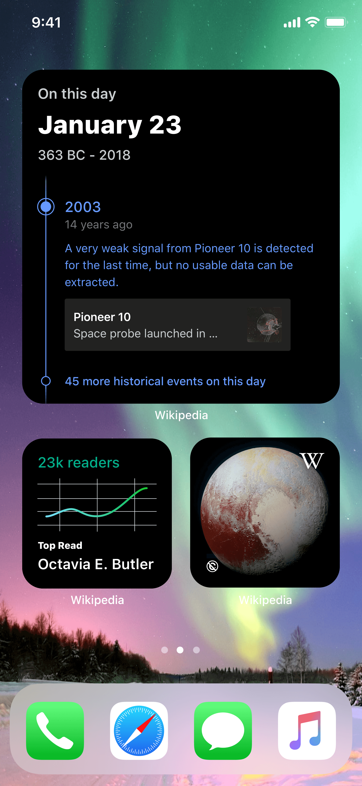
        <figcaption class="cdx-docs-figcaption">
            Wikipedia for iOS focuses on the essentials in its home screen widgets.
        </figcaption>
    </figure>
    <figure class="cdx-docs-figure">
        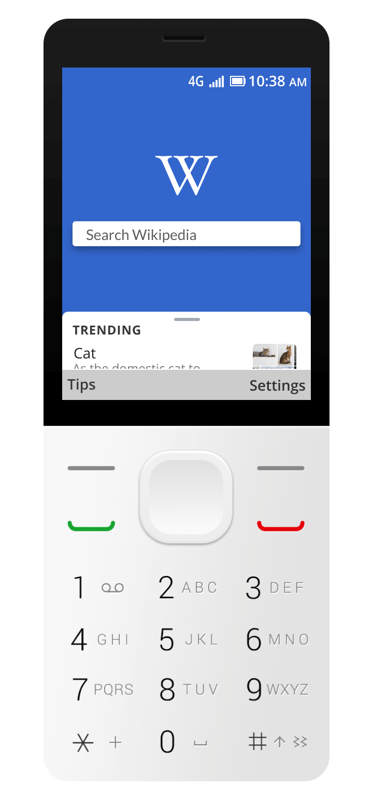
        <figcaption class="cdx-docs-figcaption">
            Trending article list for readers to discover regionally relevant content.
        </figcaption>
    </figure>

How clear is the goal? Based on Wikimedia Design’s
[“Content first” principle](./design-principles-overview.html#content-first), we aim to
**design apps that are easy to understand and focus on the essentials**. When designing, content
comes first, and control comes second. On mobile, screen real estate is limited, places of usage are
unforeseeable, and the user’s focus is reduced. We strive to reduce information density while not
neglecting an interface’s functional essence. Guiding questions like: What is the essence of this
feature? What is the purpose of this particular screen? How much information can be deprioritized
(or left out) to convey a UI’s purpose? Clarity means designing user interfaces with a clear call to
action, generous use of white space, accessible contrast, and hierarchy when designing with type or
icons. Writing concise and suitable multilingual UI copy supports users in reaching their goals more
efficiently.

### Orientation

    <figure class="cdx-docs-figure">
        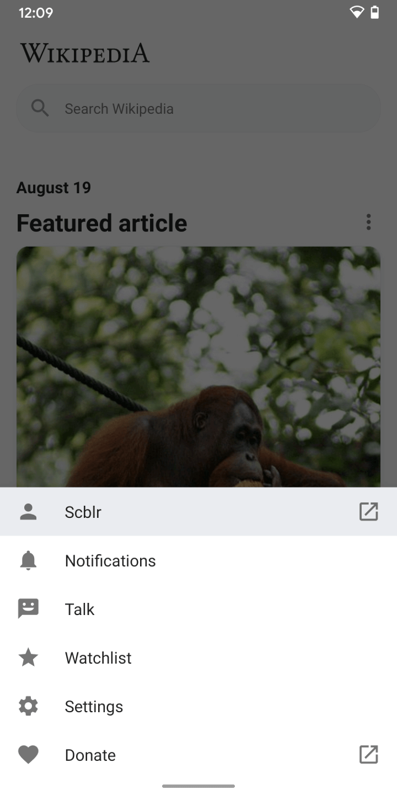
        <figcaption class="cdx-docs-figcaption">
            The 'More' navigation for Wikipedia on Android is designed to maintain the user’s
            context.
        </figcaption>
    </figure>
    <figure class="cdx-docs-figure">
        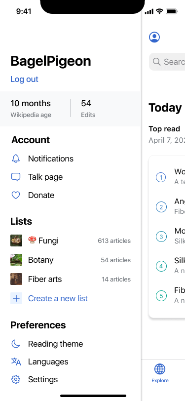
        <figcaption class="cdx-docs-figcaption">
            The off-canvas menu on Wikipedia for iOS is one tap away from anywhere in the app.
        </figcaption>
    </figure>
    <figure class="cdx-docs-figure">
        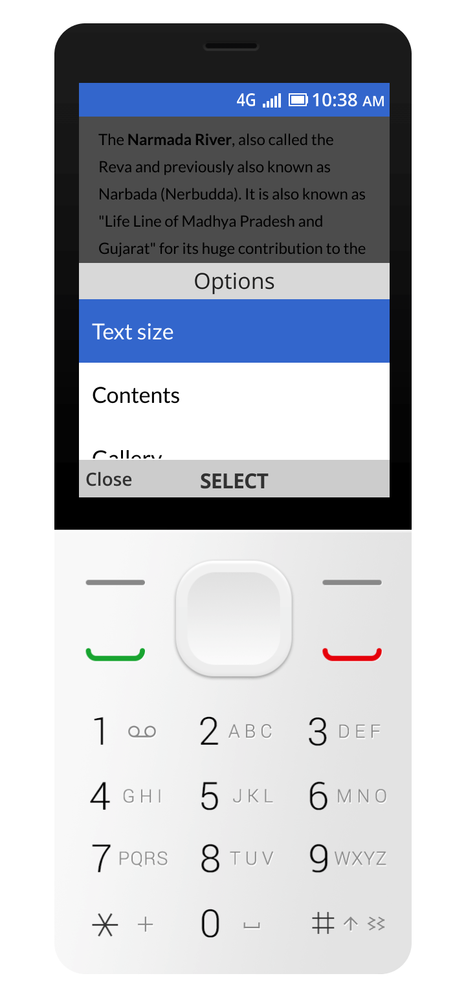
        <figcaption class="cdx-docs-figcaption">
            The 'Options' menu lets readers navigate different parts of an article to avoid too many
            key presses.
        </figcaption>
    </figure>

Where am I? [Design for consistency](./design-principles-overview.html#design-for-consistency) and
orientation are key aspects to help users navigate through an interface in a mobile app. We put
explicit effort into communicating where users are and where they can go. Spatial awareness in a
digital product directly aids users in achieving their goals. This is exemplified by consistent
navigation, depth usage, and motion application. Deliberate usage of animation and transitions helps
users navigate an interface. Visual layers and realistic motion convey hierarchy, emotion, and
understanding when using a device.

### Emotion

    <figure class="cdx-docs-figure">
        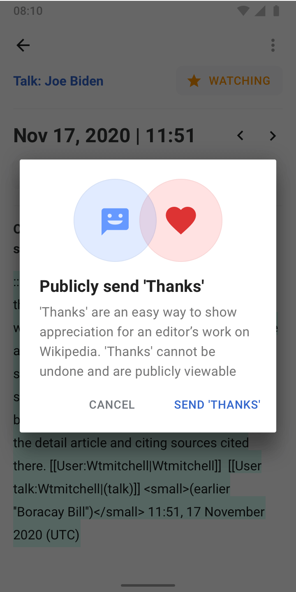
        <figcaption class="cdx-docs-figcaption">
            The 'Thanks' interaction in the Wikipedia for Android app.
        </figcaption>
    </figure>
    <figure class="cdx-docs-figure">
        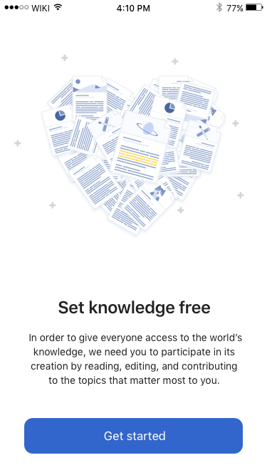
        <figcaption class="cdx-docs-figcaption">
            The onboarding experience in the Wikipedia for iOS app educates and resonates
            emotionally.
        </figcaption>
    </figure>

How does the design feel on an emotional level? An often forgotten and invisible theme but one of
the most impactful is emotional design. Along with our
[”Trustworthy yet joyful” design principle](./design-principles-overview.html#trustworthy-yet-joyful),
**we believe preserving the human touch and showing ourselves with our values in our work is essential**.
Especially on a device that is as personal as your mobile phone. Instead of creating one more cheap
and fast mass feature, we follow a philosophy paved by artists, designers, and architects of the
arts and crafts movement. After all, we design for humans and strive to create humane and emotional
experiences. Through design, we can see and connect with other human beings. To design emotional
experiences, we consider understanding the needs of the people we are designing for as the core
mission.

### Ergonomics

    <figure class="cdx-docs-figure">
        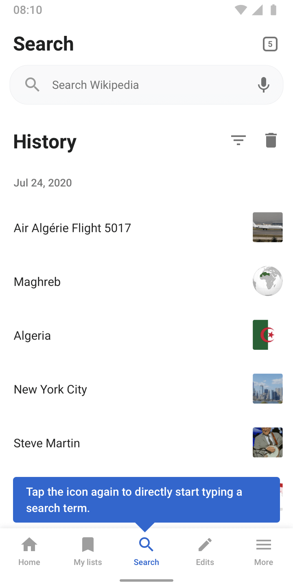
        <figcaption class="cdx-docs-figcaption">
            Example of ergonomically supporting users in the Wikipedia for Android app.
        </figcaption>
    </figure>
    <figure class="cdx-docs-figure">
        
        <figcaption class="cdx-docs-figcaption">
            Relevant actions are located near the bottom of the screen for easy access.
        </figcaption>
    </figure>
    <figure class="cdx-docs-figure">
        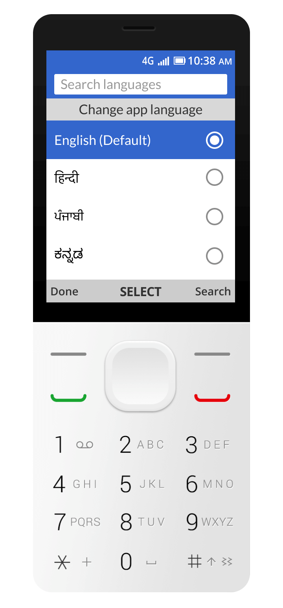
        <figcaption class="cdx-docs-figcaption">
            For non-touch interfaces, placement of key actions (e.g. search, read, edit) is
            important. We linked key actions with commonly used phone keys to make them easy to
            perform.
        </figcaption>
    </figure>

How does the design feel in my hand?
**Ergonomics, posture, context, and the tactile nature of touch affect how users interact with a design**.
The “This is for everyone” design principle is part of our core mission, and designing for touch
differs from designing for a keyboard, mouse, or trackpad. When designing for apps, we embrace
principles of [direct manipulation](https://en.wikipedia.org/wiki/Direct_manipulation_interface), an
interaction model where effects are immediately visible on the screen to the user. Designing for a
touch device goes beyond enlarging buttons for bigger fingers. We deeply consider the placement and
positioning of elements to achieve an ergonomic user experience while being aware of different
device usage types. Considering voice as the most natural machine-human input method, we ensure the
interface reflects it. We design experiences that provide ergonomics on smartphones, tablets, and
hybrid laptop/touch devices.

## Further reading

The Wikipedia Android, iOS, and KaiOS apps are each designed and developed by a specific team. If
you’re interested in learning more about the apps, or if you like to get involved, please visit
[Wikipedia Apps on mediawiki.org](https://www.mediawiki.org/wiki/Wikimedia_Apps).

### Android

- [Wikipedia for Android project page](https://www.mediawiki.org/wiki/Wikimedia_Apps/Android_FAQ)
- [Wikipedia for Android team page](https://www.mediawiki.org/wiki/Wikimedia_Apps/Team/Android)
- [Wikipedia for Android on Github](https://github.com/wikimedia/apps-android-wikipedia)
- [Wikipedia Android on Google Play](https://play.google.com/store/apps/details?id=org.wikipedia&hl=en&gl=US)
- [Wikipedia Android App promo video on YouTube](https://www.youtube.com/watch?v=6UkFHYqVsbc)
- [Android color guidelines](https://www.mediawiki.org/wiki/Wikimedia_Apps/Android_theme_guidelines)
- [Google Material Design Guidelines](https://material.io/)

### iOS

- [Wikipedia iOS project page](https://www.mediawiki.org/wiki/Wikimedia_Apps/Team/iOS)
- [Wikipedia iOS team page](https://www.mediawiki.org/wiki/Wikimedia_Apps/Team/iOS)
- [Wikipedia for iOS on Github](https://github.com/wikimedia/wikipedia-ios)
- [Wikipedia for iOS in the App Store](https://apps.apple.com/us/app/wikipedia/id324715238)
- [iOS color guidelines](https://phabricator.wikimedia.org/T169148)
- [Apple Human Interface Guidelines](https://developer.apple.com/design/human-interface-guidelines/ios/overview/themes/)

### KaiOS

- [Wikipedia for KaiOS project page](https://www.mediawiki.org/wiki/Wikipedia_for_KaiOS)
- [Wikipedia for KaiOS on Github](https://github.com/wikimedia/wikipedia-kaios)
- [Wikipedia KaiOS app simulator](https://wikimedia.github.io/wikipedia-kaios/sim.html)
- [KaiOS documentation](https://developer.kaiostech.com/docs/)
